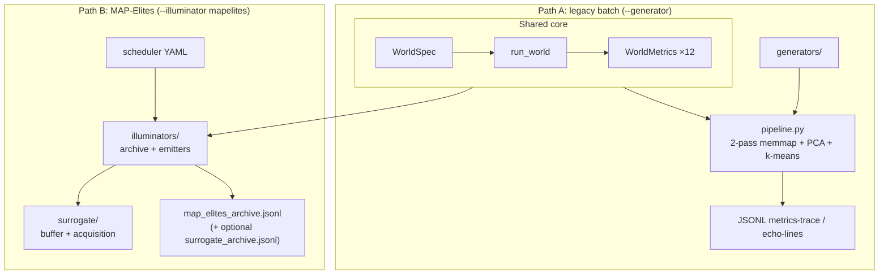
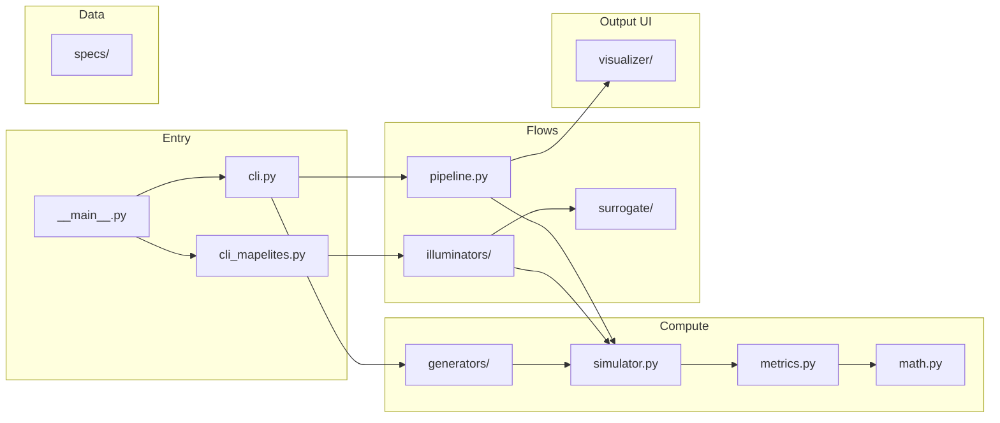
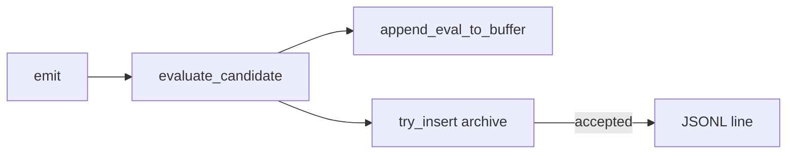
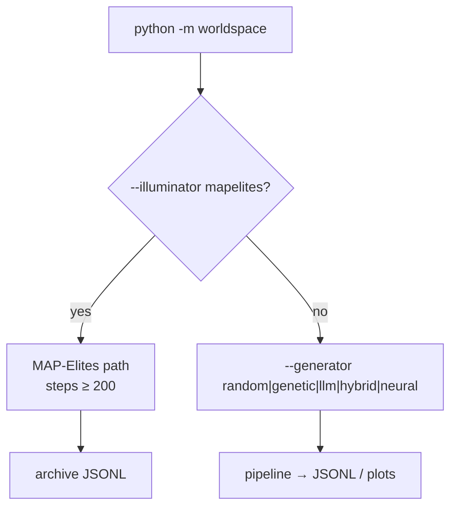

# WorldSpace architecture

> Canonical path: **`docs/ARCHITECTURE.md`**.  
> High-level map of the `worldspace` package. Deep dives live in linked docs — avoid duplicating them here.

**Goal:** treat each cellular-automata world as a point in rule space → simulate → extract a behavioral fingerprint → compare or archive worlds.

The package is an **offline research pipeline** (no `celery`, `redis`, or legacy web stack).

---

## Documentation map

| Document | Read this for |
| --- | --- |
| [**FORMULAS.md**](FORMULAS.md) | Metrics, fitness, coefficients, genome encoding |
| [**WORLDSPACE.md**](WORLDSPACE.md) | `WorldSpec`, simulator, legacy pipeline (PCA/k-means), generators, CLI flags |
| [**MAPELITES.md**](MAPELITES.md) | MAP-Elites loop, archive JSONL, schedulers, emitters, resume, nightly |
| [**SURROGATE_MODEL.md**](SURROGATE_MODEL.md) | Features, training, LLM hints, acquisition (`shadow` / `filter`), calibration |
| [**DASHBOARD.md**](DASHBOARD.md) | Streamlit UI (setup, pages, config) |
| [**DOMAINS.md**](DOMAINS.md) | Maze / dungeon / sphere packages (separate runners, not main CLI) |
| [artifacts/surrogate/README.md](../artifacts/surrogate/README.md) | Buffer paths, train commands, checkpoint names |

---

## Two execution paths

Same core (`WorldSpec` → `run_world` → `WorldMetrics`), different **orchestration**:

| | Legacy batch | MAP-Elites illuminator |
| --- | --- | --- |
| **Entry** | `python -m worldspace --generator …` | `python -m worldspace --illuminator mapelites` |
| **Doc** | [WORLDSPACE.md §6–8](WORLDSPACE.md) | [MAPELITES.md](MAPELITES.md) |
| **Output** | Per-batch 2D layout + `cluster_id` | Global niche archive (BC grid) |
| **Fitness** | `mo_eoc_indicator` (GA/LLM) | `compute_fitness` in `evaluation.py` |
| **Scale** | `n` worlds per CLI run | `iterations × batch_size` simulations |

---

## Package layout

| Path | Role |
| --- | --- |
| `specs/spec.py` | `WorldSpec` JSON dataclass |
| `specs/world_param_bounds.py`, `world_spec_constraints.py`, `world_spec_from_llm.py` | Clamps, validation, LLM parse |
| `generators/` | Random → Markov → GA → LLM → hybrid → neural ([WORLDSPACE.md §7](WORLDSPACE.md)) |
| `simulator.py` | `run_world` → `SimulationResult` |
| `metrics.py` | `WorldMetrics`, `METRICS_VECTOR_DIM=12` |
| `pipeline.py` | `stream_world_space_to_jsonl` |
| `illuminators/` | MAP-Elites loop, archive, evaluation, emitters |
| `surrogate/` | Features, buffer, `get_surrogate`, acquisition policies |
| `mazes/`, `dungeons/`, `benchmarks/` | Parallel domains ([DOMAINS.md](DOMAINS.md)) — not main CLI |
| `visualizer/` | **Deprecated** matplotlib PNG from pipeline JSONL traces |
| `dashboard/` (repo root) | **Primary** Streamlit UI (archives, surrogate, metrics, acquisition log) |
| `scripts/run_map_elites_nightly.py` | `make nightly-map-elites` |

---

## Core types and artifacts

| Artifact | Format | Produced by | Spec |
| --- | --- | --- | --- |
| `WorldSpec` | JSON object | Generators / emitters | [WORLDSPACE.md §3](WORLDSPACE.md) |
| Metrics vector | 12 floats | `run_world` | [WORLDSPACE.md §5](WORLDSPACE.md) |
| `--metrics-trace` JSONL | 1 line / world | `pipeline.py` | [WORLDSPACE.md §6.1](WORLDSPACE.md) |
| `--ca-step-trace` JSONL | 1 line / CA step | `pipeline` only | [WORLDSPACE.md §8](WORLDSPACE.md) |
| `map_elites_archive.jsonl` | schema 1.2 / 1.3 | `illuminators/archive.py` | [MAPELITES.md §10](MAPELITES.md) |
| `cvt_centroids.json` | CVT only | `illuminators/cvt.py` | [MAPELITES.md §10.1](MAPELITES.md) |
| Surrogate buffer JSONL | `features` + `targets` | `surrogate/buffer.py` | [SURROGATE_MODEL.md](SURROGATE_MODEL.md) |
| SurrogateArchive JSONL | acquisition decisions schema 1.0 | dashboard loader | Surrogate Acquisition |
| `nightly_run_summary.json` | JSON | `nightly_report.py` | [MAPELITES.md §10.3](MAPELITES.md) |

---

## Simulator (summary)

`run_world(world, *, ca_step_trace_file=…, early_extinction_step=…)` — full semantics in [WORLDSPACE.md §4](WORLDSPACE.md).

| Mode | `early_extinction_step` | Used by |
| --- | --- | --- |
| Legacy pipeline | `None` (full `steps`) | `--generator` |
| MAP-Elites | `200` (default in YAML) | `--illuminator mapelites` |

Online accumulators only (no per-step grid lists): density Welford stats, death-age sums, 512-step density window, one final `life` snapshot.

---

## MAP-Elites (summary)

| Piece | Location |
| --- | --- |
| Orchestrator | `MapElitesIlluminator.run` |
| Loop | `run_scheduler` / `run_iteration` |
| BC axes | `stability`, `diversity` → bin `(i,j)` |
| Emitters | `random` / `genetic` / `llm` per YAML slot |
| Schedulers | `specs/map_elites_scheduler*.yaml` |

Detail: state graphs, fitness formula, resume, nightly phases → [**MAPELITES.md**](MAPELITES.md).

---

## Surrogate (summary)

Default production checkpoint: `artifacts/surrogate/checkpoints/nightly_v3_mc_d005.pkl` (feature schema **2.1**, 24-dim).

| Does | Does not |
| --- | --- |
| Log `(features, targets)` after each real eval (when enabled) | Replace archive fitness (always from simulation) |
| Inject `surrogate_mean` / uncertainty into LLM prompts | Change insert rules for evaluated elites |
| Optional **acquisition**: `shadow` (log would-skip) or `filter` (skip `evaluate_candidate`) | Run when `acquisition.mode: off` (default) |

Optional nested retrain: `surrogate.retrain` in scheduler YAML (`worldspace/surrogate/retrain.py`). Detail → [**SURROGATE_MODEL.md**](SURROGATE_MODEL.md).

---

## CLI quick reference

| Command | Doc section |
| --- | --- |
| `--generator random --worlds N --steps S --grid G` | [WORLDSPACE.md §8](WORLDSPACE.md) |
| `--metrics-trace`, `--ca-step-trace`, `--echo-lines` | [WORLDSPACE.md §8](WORLDSPACE.md) |
| `--illuminator mapelites --scheduler … --output-dir …` | [MAPELITES.md §2](MAPELITES.md) |
| `streamlit run dashboard/Home.py` (or `cd dashboard && streamlit run Home.py`) | [DASHBOARD.md](DASHBOARD.md) |
| `python -m worldspace.illuminators …` | Alternate MAP-Elites entry (same illuminator CLI) |
| `python -m worldspace.visualizer --output-dir …` | **Deprecated** pipeline PNG only — [WORLDSPACE.md §8](WORLDSPACE.md) |

---

## YAML configuration

| File | Consumer |
| --- | --- |
| `specs/genetic_world_generator.yaml` | `--generator genetic` |
| `specs/llm_world_generator.yaml` | `--generator llm` |
| `specs/hybrid_world_generator.yaml` | `--generator hybrid` |
| `specs/neural_world_generator.yaml` | `--generator neural` |
| `specs/map_elites_scheduler.yaml` | Production MAP-Elites (10k iter) |
| `specs/map_elites_scheduler_mini.yaml` | CI smoke (grid) |
| `specs/map_elites_scheduler_mini_cvt.yaml` | CI smoke (CVT) |
| `specs/map_elites_scheduler_nightly.yaml` | Nightly baseline |
| `specs/map_elites_scheduler_nightly_surrogate.yaml` | Nightly + surrogate |

Override: `--generator-spec PATH` (legacy) or `--scheduler PATH` (MAP-Elites).

---

## Automation

| Target | What runs |
| --- | --- |
| `make smoke-map-elites` | Mini scheduler (grid + CVT), `artifacts/map_elites_smoke/` and `artifacts/map_elites_smoke_cvt/` |
| `make nightly-map-elites` | Baseline → train surrogate → surrogate phase ([MAPELITES.md §12](MAPELITES.md)) |
| `.github/workflows/map_elites_smoke.yml` | CI smoke |

Prompts (not duplicated here): `prompts/` — MAP-Elites `map_elites_llm_emitter_*`; legacy `llm_patch_*`. Loaded via `worldspace/prompt_files.py`.

---

## See also

- [FORMULAS.md](FORMULAS.md) — equations and coefficient rationale
- [WORLDSPACE.md](WORLDSPACE.md) — parameters, metrics, simulator, legacy pipeline
- [MAPELITES.md](MAPELITES.md) — quality-diversity search
- [SURROGATE_MODEL.md](SURROGATE_MODEL.md) — surrogate + acquisition
- [DOMAINS.md](DOMAINS.md) — maze / dungeon / sphere runners
