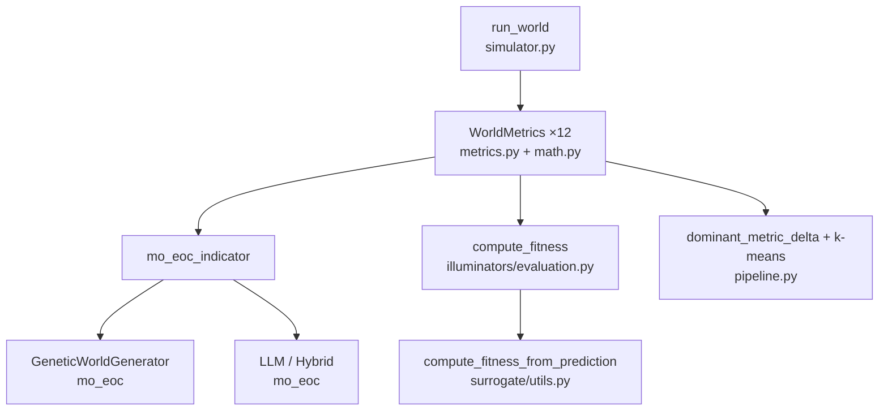
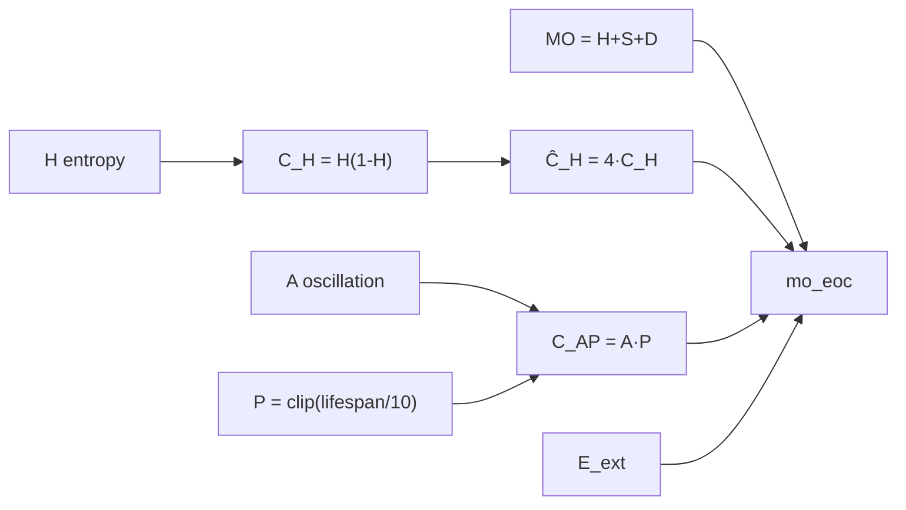

# Formulas and fitness functions

> Canonical path: **`docs/FORMULAS.md`**.  
> Every scalar objective and metric used in `worldspace`, with code references and coefficient rationale.

Related docs (narrative, not duplicated here):

| Doc | Role |
| --- | --- |
| [WORLDSPACE.md](WORLDSPACE.md) | Simulator semantics, parameter meaning |
| [MAPELITES.md](MAPELITES.md) | Archive, emitters, JSONL |
| [ARCHITECTURE.md](ARCHITECTURE.md) | Two execution paths |
| [SURROGATE_MODEL.md](SURROGATE_MODEL.md) | Surrogate training |

---

## 1. Where each formula is used

| Formula family | Primary code | Used by |
| --- | --- | --- |
| CA update rules | `simulator.py` | All paths |
| 12 behavioral metrics | `simulator.py`, `math.py` | All paths |
| `mo_eoc_indicator` | `metrics.py` | `--generator` genetic / LLM / hybrid |
| `compute_fitness` | `illuminators/evaluation.py` | MAP-Elites archive |
| Dominant-metric 2D + k-means | `pipeline.py`, `math.py` | Legacy `--generator` batch |
| 21-gene genome | `generators/__init__.py`, `illuminators/emitters/genetics.py` | GA, MAP-Elites genetic emitter |
| Surrogate hold-out gates | `surrogate/evaluation.py` | `train_surrogate.py` |

---

## 2. Simulator dynamics (per CA step)

Notation: cell \((x,y)\), `neighbors` = Moore live-neighbor count (torus, 8 neighbors). Code: `simulator.py`, `math.neighbor_count`.

### 2.1 Birth and survival (deterministic core)

\[
\text{born} = \mathbf{1}[\text{life}=0 \land \text{neighbors} \in \text{birth}]
\]
\[
\text{survive} = \mathbf{1}[\text{life}=1 \land \text{neighbors} \in \text{survival}]
\]
\[
\text{next\_life} = \max(\text{born}, \text{survive}) \quad \text{(per cell)}
\]

| Symbol | `WorldSpec` field | Role |
| --- | --- | --- |
| `birth` | `list[int]` | Neighbor counts that **create** life on dead cells |
| `survival` | `list[int]` | Neighbor counts where **live** cells stay alive |

**Why lists, not a single rule:** generalizes Conway-style Life (e.g. B3/S23) to a searchable rule space.

### 2.2 Stochastic noise

For each cell, independently after birth/survival:

\[
\text{flip} \sim \mathrm{Bernoulli}(\texttt{noise}), \quad
\text{next\_life} \leftarrow 1 - \text{next\_life} \text{ if flip}
\]

| Coefficient | Typical range (generators) | Purpose |
| --- | --- | --- |
| `noise` | clipped to \([0, 0.2]\) in genome | Cell-level randomness; pushes dynamics away from pure deterministic CA |

### 2.3 Predation (crowding pressure)

When `predation > 0`:

\[
\text{exposure} = \frac{\text{neighbors}}{8}, \quad
\text{die} \sim \mathrm{Bernoulli}(\texttt{predation} \cdot \text{exposure}) \text{ on live cells}
\]

| Coefficient | Range | Purpose |
| --- | --- | --- |
| `predation` | \([0, 1]\) in genome | Higher neighbor density → higher death chance; crude competition without a predator type |

### 2.4 Food and aging

| Step | Formula / rule | Purpose |
| --- | --- | --- |
| Init life | `Bernoulli(0.2)` per cell | **Fixed** 20% initial occupancy (not from `WorldSpec`) |
| Init food | `Bernoulli(resource_regen)` | Starting food density |
| Regen each step | `food ← 1` with prob `resource_regen` | Resource appearance |
| Feed | if `food==1` and cell alive: `food←0`, `feed_bonus=1` | Consumption |
| Ages | live: `ages += 1 + feed_bonus`; dead: `ages ← 0` | Lifespan statistic input |

`resource_regen` ∈ \([0, 0.5]\) after genome clip.

### 2.5 Early extinction (MAP-Elites only)

Stop when mean life density is 0 at timestep \(t+1\) with \(0 \le t < \texttt{early\_extinction\_step}\) (default **200**). Sets `early_extinct=True` → archive fitness **0** (see §6).

---

## 3. Online statistics (inside `run_world`)

No full time series stored; only accumulators.

### 3.1 Density mean and stability (Welford)

Each step, \(\rho_t = \mathrm{mean}(\text{life})\). Welford update (`_welford_append`):

\[
n \leftarrow n+1,\quad
\delta = \rho_t - \mu,\quad
\mu \leftarrow \mu + \delta/n,\quad
M_2 \leftarrow M_2 + \delta(\rho_t - \mu)
\]

After the run:

\[
\sigma_\rho = \sqrt{\frac{M_2}{\max(n-1,\,1)}}
\]

\[
\boxed{
\text{stability} = \mathrm{clip}\left(1 - \frac{\sigma_\rho}{\mu + 10^{-6}},\, 0,\, 1\right)
}
\]

| Term | Why |
| --- | --- |
| \(\mu\) (`density_mean`) | Typical fill level over the run |
| \(\sigma_\rho / \mu\) | Coefficient of variation of density — low → steady dynamics |
| `1e-6` | Avoid division by zero when \(\mu \approx 0\) |
| Clip to \([0,1]\) | BC axis and comparable weights |

### 3.2 Average lifespan

On death events, sum ages at death:

\[
\text{average\_lifespan} =
\begin{cases}
\text{death\_age\_sum} / \text{death\_count} & \text{if deaths} > 0 \\
0 & \text{otherwise}
\end{cases}
\]

Used in `mo_eoc` as persistence proxy \(P\) (§5.2).

### 3.3 Oscillation window

Last **512** density values (`OSCILLATION_DENSITY_WINDOW`). Autocorrelation peaks (`math.oscillation`, `max_lag=10`):

\[
\text{centered}_t = \rho_t - \bar{\rho}, \quad
r_\ell = \frac{\sum_t \text{centered}_t \cdot \text{centered}_{t+\ell}}{\sum_t \text{centered}_t^2 + 10^{-9}}
\]
\[
\boxed{\text{oscillation\_score} = \max_{\ell=1..\min(10,\,T-1)} |r_\ell|}
\]

| Design choice | Rationale |
| --- | --- |
| Window 512 | Bounded memory vs full run length |
| Max abs correlation | Single scalar “is there periodic density motion” |
| Not clipped in metric | Can exceed 1 in edge cases; clipped where used in fitness |

---

## 4. Final-grid metrics (`math.py`)

Computed once from final `life` / `food`.

### 4.1 Entropy (on mean density, not spatial)

\[
p = \mathrm{clip}(\overline{\rho},\, 10^{-9},\, 1-10^{-9}), \quad
H = -\bigl(p\log_2 p + (1-p)\log_2(1-p)\bigr)
\]

**Not** spatial pattern entropy — entropy of “mean occupancy as a Bernoulli parameter.” Feeds `mo_eoc` and metric `entropy` ∈ \([0,1]\).

### 4.2 Diversity (sampled patches)

128 random toroidal **3×3** patches on final `life`; signature = flattened 9 bits.

\[
\boxed{\text{diversity} = \frac{|\{\text{unique signatures}\}|}{128}}
\]

| Parameter | Value | Why |
| --- | --- | --- |
| `sample_size` | 128 | Fixed cost vs grid size |
| Patch 3×3 | — | Local pattern proxy, not global spectrum |
| `rng` seed 0 | — | Reproducible across runs with same final grid |

Also a MAP-Elites **BC axis** (after clip).

### 4.3 Topology proxies

**Interface index** — mean fraction of Moore neighbors where `life` differs:

\[
\text{topology\_interface\_index} =
\mathrm{clip}\left(\frac{1}{N}\sum_{x,y} \frac{\sum_{\text{nb}} \mathbf{1}[\text{life}_{nb} \neq \text{life}_{x,y}]}{8},\, 0,\, 1\right)
\]

**Window heterogeneity** — fraction of toroidal 2×2 windows with not-all-equal corners:

\[
\text{topology\_window\_heterogeneity} =
\mathrm{mean}_{(i,j)}\mathbf{1}[\text{not all equal in }2\times2\text{ window at }(i,j)]
\]

| Metric | High value means | Not computing |
| --- | --- | --- |
| Interface | Fragmented live/dead boundaries | Betti numbers |
| Window heterogeneity | Local mixing / non-uniformity | Persistent homology |

### 4.4 Compressibility

Raw bytes = `life` ∥ `food` row-major (uint8). zlib level 6.

\[
\boxed{
\text{compressibility\_score} =
\mathrm{clip}\left(1 - \frac{\mathrm{len}(\mathrm{zlib.compress(raw)})}{\mathrm{len(raw)}},\, 0,\, 1\right)
}
\]

High score → more compressible → “simpler” configuration (description-length proxy).

### 4.5 Ecology (joint life + food)

Per cell: `code = life + 2·food` ∈ {0,1,2,3}. Counts \(n_k\), \(p_k = n_k/\sum n\), \(k\) = number of **non-empty** classes.

\[
H_{\text{state}} = -\sum_k p_k \log_2 p_k, \quad
\boxed{
\text{ecology\_state\_entropy\_norm} =
\mathrm{clip}\left(\frac{H_{\text{state}}}{\log_2 k},\, 0,\, 1\right)
}
\]

\(k \le 1\) → metric 0 (no diversity).

**Resource adjacency** — among live cells only, mean Moore fraction of neighbors with `food==1`:

\[
\boxed{
\text{ecology\_resource\_adjacency} =
\mathrm{clip}\left(\mathrm{mean}_{(x,y):\,\text{life}=1}\frac{\sum_{\text{nb}} \mathbf{1}[\text{food}_{nb}=1]}{8},\, 0,\, 1\right)
}
\]

---

## 5. `mo_eoc_indicator` (generator fitness)

**Code:** `metrics.multi_objective_edge_of_chaos_indicator`  
**Consumers:** `GeneticWorldGenerator`, `LLMWorldGenerator`, `HybridGALlmWorldGenerator` (sort / PyGAD fitness).

Inputs (already computed):

| Symbol | Field | Range |
| --- | --- | --- |
| \(H\) | `entropy` | \([0,1]\) |
| \(S\) | `stability` | \([0,1]\) |
| \(D\) | `diversity` | \([0,1]\) |
| \(A\) | `oscillation_score` | usually \(\le 1\) |
| \(E_{\mathrm{ext}}\) | `extinction_penalty` = \(\mathrm{clip}(1-\rho_{\mathrm{final}},0,1)\) | \([0,1]\) |

Derived:

\[
C_H = H(1-H), \quad \widehat{C}_H = 4\,C_H = \frac{C_H}{0.25}
\]
\[
P = \mathrm{clip}\left(\frac{\text{average\_lifespan}}{10},\, 0,\, 1\right), \quad
C_{AP} = A \cdot P
\]
\[
\mathrm{MO} = H + S + D
\]

### 5.1 Final formula and coefficients

\[
\boxed{
\mathrm{mo\_eoc}
=
\mathrm{MO}\cdot\bigl(0.50 + 0.30\,\widehat{C}_H + 0.20\,C_{AP}\bigr)
+ 0.15\,A\,\widehat{C}_H
+ 0.10\,P
- E_{\mathrm{ext}}
}
\]

| Coef. | Term | Intent |
| --- | --- | --- |
| **0.50** | Base multiplier on \(\mathrm{MO}\) | Even “boring” worlds retain half weight on \(H+S+D\) |
| **0.30** \(\widehat{C}_H\) | Inside bracket | Reward **mid-entropy** regimes (edge-of-chaos band), not empty/saturated extremes |
| **0.20** \(C_{AP}\) | Inside bracket | Link **oscillation** with **persistence** (cells that lived long enough to die with age recorded) |
| **0.15** \(A\widehat{C}_H\) | Additive | Extra dynamics bonus when both oscillation and entropic curvature are high |
| **0.10** \(P\) | Additive | Mild preference for longer mean death age |
| **−1.0** \(E_{\mathrm{ext}}\) | Subtractive | Penalize final near-extinction (same signal as empty field) |

**Not normalized to \([0,1]\)** — by design for ranking in GA/sorts; upper bound grows with \(\mathrm{MO}\).

---

## 6. MAP-Elites archive fitness

**Code:** `illuminators/evaluation.compute_fitness`  
**Distinct from** `mo_eoc_indicator` — do not compare numerically across systems.

If `early_extinct`: \(\text{fitness} = 0\).

Otherwise, with \(\rho_{\mathrm{final}} = \mathrm{mean}(\text{final\_life})\):

\[
E_{\mathrm{ext}} = \mathrm{clip}(1 - \rho_{\mathrm{final}},\, 0,\, 1)
\]
\[
T = \mathrm{clip}\left(\frac{\text{topology\_interface\_index} + \text{topology\_window\_heterogeneity}}{2},\, 0,\, 1\right)
\]

\[
\boxed{
\text{fitness} = \mathrm{clip}\bigl(
0.45\,D
+ 0.25\,(1 - E_{\mathrm{ext}})
+ 0.20\,\mathrm{clip}(A,\,0,\,1)
+ 0.10\,T
,\, 0,\, 1\bigr)
}
\]

where \(D = \mathrm{clip}(\text{diversity})\), \(A = \text{oscillation\_score}\) (BC uses stability + diversity only).

| Weight | Term | Why in illuminator fitness |
| --- | --- | --- |
| **0.45** | Diversity | Primary “interesting behavior” in niche — pattern variety on final grid |
| **0.25** | \(1 - E_{\mathrm{ext}}\) | Survive to end of run (or at least non-empty final state) |
| **0.20** | Oscillation | Non-trivial temporal dynamics |
| **0.10** | Topology mix | Morphological complexity without expensive homology |
| **0** | `entropy`, `mo_eoc`, ecology | Not in archive score (may still appear in JSONL `metrics`) |

**Surrogate training** rebuilds this same fitness via `compute_fitness_from_prediction` (`surrogate/utils.py`), with `early_extinct` when `early_extinction_prob ≥ 0.5`.

---

## 7. Behavioral binning (MAP-Elites grid)

BC axes: `stability`, `diversity` (clipped to \([0,1]\)).

Edges: `np.linspace(0, 1, resolution + 1)`. Index:

\[
i = \mathrm{searchsorted}(\text{edges}, s,\, \text{side='right'}) - 1,\quad
\text{clipped to } [0,\, \text{resolution}-1]
\]

(same for \(j\) on diversity). Cell center for emitter hint:

\[
\text{center}_i = \frac{\text{edges}_i + \text{edges}_{i+1}}{2}
\]

---

## 8. Legacy pipeline: 2D layout and clustering

**Code:** `pipeline.py`, `math.kmeans_lloyd_on_memmap`

### 8.1 Dominant-metric-delta projection

For batch matrix \(X \in \mathbb{R}^{n \times 12}\), mean \(\bar{\mathbf{x}}\), variances per column:

\[
j = \arg\max_k \mathrm{Var}(X_{:,k}), \quad
x_i = X_{i,j} - \bar{x}_j
\]

Let \(X'\) = \(X\) without column \(j\). sklearn `PCA(n_components=1)` on \(X'\) (centers columns internally):

\[
y_i = \mathrm{PC1}(X'_{i,:})
\]

If \(n < 2\): \(y_i = 0\) for all \(i\).

| Axis | Meaning |
| --- | --- |
| \(x\) | Deviation on the **most variable metric in this batch** |
| \(y\) | Combined variation in the **other 11** metrics |

**Not** the same as `pca.png` / `umap.png` (those use all 12 metrics — see visualizer).

### 8.2 k-means (Lloyd)

\[
\ell_i = \arg\min_j \| \mathbf{x}_i - \mathbf{c}_j \|_2^2, \quad
\mathbf{c}_j = \frac{1}{|C_j|}\sum_{i \in C_j} \mathbf{x}_i
\]

Up to 30 iterations, \(k\) = CLI `--k-clusters` (default 4). Empty cluster → small random centroid (`math.py`, seed 42). Distance in **full 12D** metric space, not in \((x,y)\).

---

## 9. Genome encoding (21 genes)

**Code:** `generators.GeneticWorldGenerator`, `illuminators/emitters/genetics.py`

| Index | Content | Decode |
| --- | --- | --- |
| 0–8 | birth mask bits | `birth = { i : bit_i = 1 }`; if empty → argmax index |
| 9–17 | survival mask bits | same for `survival` |
| 18 | `noise` | clip \([0, 0.2]\) |
| 19 | `resource_regen` | clip \([0, 0.5]\) |
| 20 | `predation` | clip \([0, 1]\) |

Neighbor counts in rules are **0…8** (Moore on torus); masks index **0…8** as “is this neighbor count in the set.”

### 9.1 Genetic operators (MAP-Elites emitter)

**Uniform crossover:** per gene, 50% from parent A or B.

**Gaussian mutation** (`mutation_scale` from scheduler, default 0.02):

\[
p_{\text{flip}} = \mathrm{clip}(5 \cdot \texttt{mutation\_scale},\, 0,\, 1)
\]

For genes 0–17: flip bit with prob \(p_{\text{flip}}\). For genes 18–20: add \(\mathcal{N}(0, \texttt{mutation\_scale})\) then clip to bounds.

| Constant | Value | Why |
| --- | --- | --- |
| `_BIT_FLIP_SCALE` | 5.0 | Scale 0.02 → ~10% bit flip rate per rule gene |
| `FLOAT_GENE_START` | 18 | Separate discrete rules vs continuous params |

**Random walk** (LLM fallback, Markov generators):  
\(\text{value}' = \mathrm{clip}(\text{value} + \mathcal{N}(0, \texttt{scale}), \texttt{low}, \texttt{high})\).

---

## 10. Generators: what is optimized

| Generator | Objective / selection | Formula ref |
| --- | --- | --- |
| `RandomWorldGenerator` | None (uniform sample) | — |
| `RandomWalkWorldGenerator` | Local moves in rule space | §9 random walk |
| Markov generators | State-driven noise/bias | YAML transitions |
| **`GeneticWorldGenerator`** | Maximize **`mo_eoc_indicator`** per PyGAD solution | §5 |
| **`LLMWorldGenerator`** | Iterative improve **`mo_eoc_indicator`** | §5 |
| **`HybridGALlmWorldGenerator`** | Population sorted by **`mo_eoc_indicator`**; top-k + diversity | §5 |
| `NeuralWorldGenerator` | MLP decodes rules (YAML policy) | Not a closed-form scalar here |
| MAP-Elites **`RandomEmitter`** | None | — |
| MAP-Elites **`GeneticEmitter`** | Implicit via archive **`compute_fitness`** | §6 |
| MAP-Elites **`LlmEmitter`** | Archive fitness; LLM sees surrogate hints | §6, [SURROGATE_MODEL.md](SURROGATE_MODEL.md) |

### 10.1 GeneticWorldGenerator (PyGAD) details

- Fitness per chromosome: `run_world(world).metrics.mo_eoc_indicator` (§5).
- Cache key: `(generation, rounded solution)` to avoid duplicate sims.
- `mutation_probability` from YAML, often `clip(0.12 + diversity_penalty * 0.2, 0.05, 0.6)`.
- `diversity_penalty`, `elite_count`, `max_stagnation`: GA exploration knobs in `genetic_world_generator.yaml` (not in closed-form fitness).

### 10.2 Hybrid selection

Sort by `mo_eoc_indicator` descending; take top `select_top_k` plus random draws from remainder for diversity — still **same scalar** §5, not a second formula.

---

## 11. Surrogate training metrics (offline)

**Code:** `surrogate/evaluation.py` — compares model to ground-truth **`compute_fitness`** (§6), not `mo_eoc`.

| Gate | Threshold | Meaning |
| --- | --- | --- |
| `QUALITY_R2_FITNESS_MIN` | > 0.72 | Hold-out R² on fitness |
| `QUALITY_MAE_FITNESS_MAX` | < 0.085 | Mean absolute error on fitness |
| `QUALITY_MAE_STABILITY_MAX` | < 0.06 | MAE on `stability` target |

Training targets per row (`surrogate/buffer.py`): `stability`, `diversity`, `oscillation_score`, `topology_interface_index`, `topology_window_heterogeneity`, `final_density`, `early_extinction_prob`.

---

## 12. Constants quick reference

| Constant | Value | Location |
| --- | --- | --- |
| `METRICS_VECTOR_DIM` | 12 | `metrics.py` |
| Initial life density | 0.2 | `simulator._initial_grids` |
| `OSCILLATION_DENSITY_WINDOW` | 512 | `math.py` |
| Oscillation max lag | 10 | `math.oscillation` |
| Diversity sample patches | 128, 3×3 | `math.pattern_diversity_from_frame` |
| `ILLUMINATOR_MIN_STEPS` | 200 | `evaluation.py` |
| Default `early_extinction_step` | 200 | scheduler YAML |
| `GENOME_SIZE` | 21 | `emitters/genetics.py` |
| MO+EoC lifespan scale | 10 | `metrics.py` (for \(P\)) |
| MO+EoC \(C_H\) norm divisor | 0.25 | `metrics.py` |
| k-means max iter | 30 | `math.kmeans_lloyd_on_memmap` |
| k-means empty-cluster noise | 0.01 | `math.py` |

---

## See also

- [WORLDSPACE.md](WORLDSPACE.md) §4–5 — prose around simulator and metrics
- [MAPELITES.md](MAPELITES.md) §4–5 — archive fitness in context
- [ARCHITECTURE.md](ARCHITECTURE.md) — which path uses which objective
