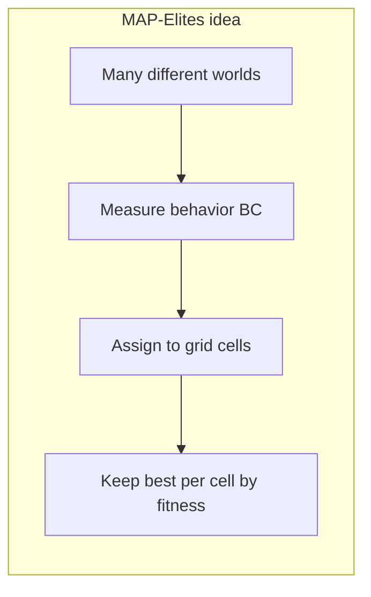
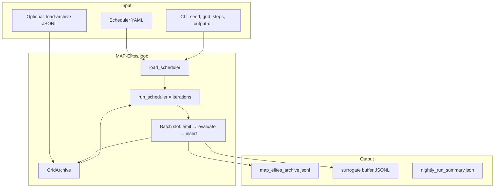
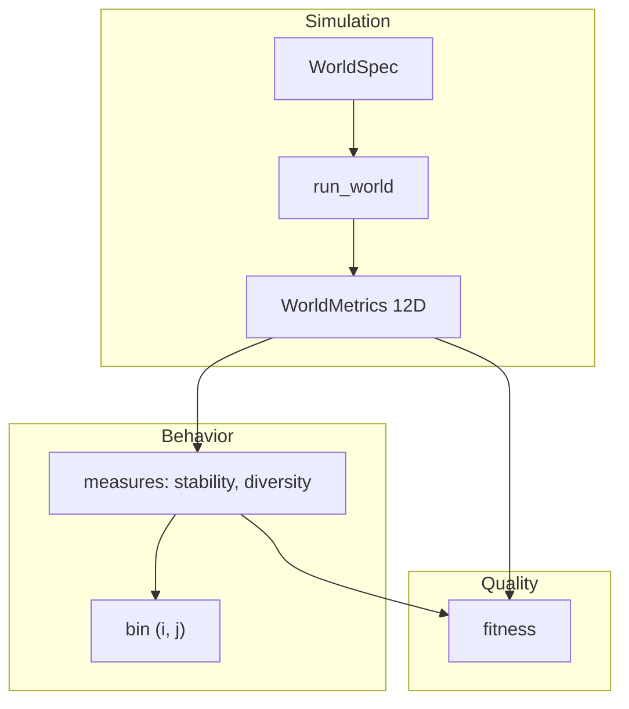
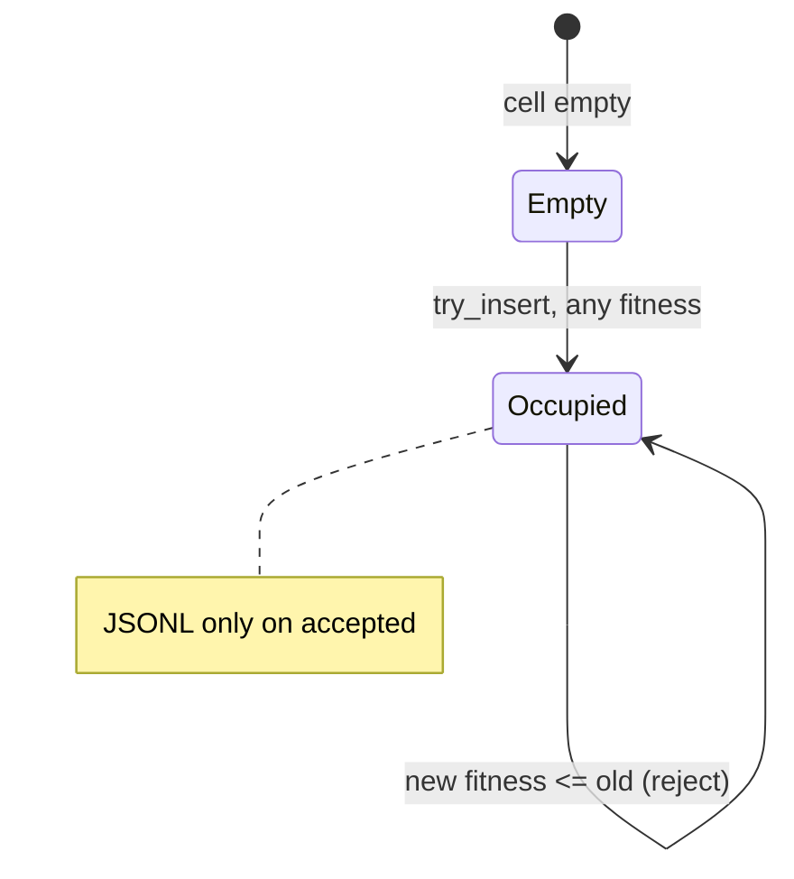
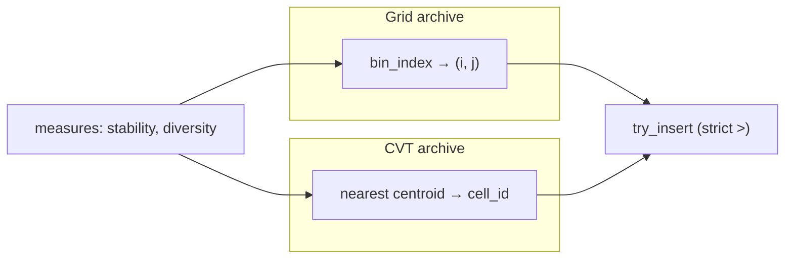
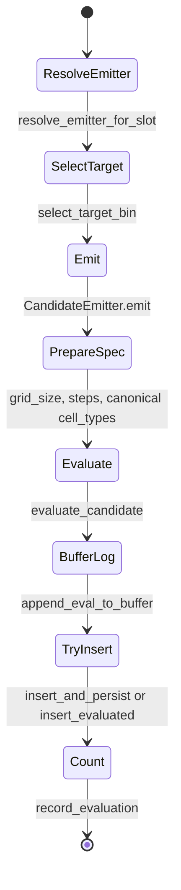
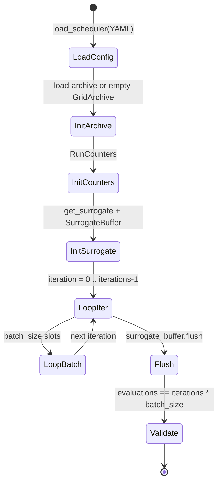
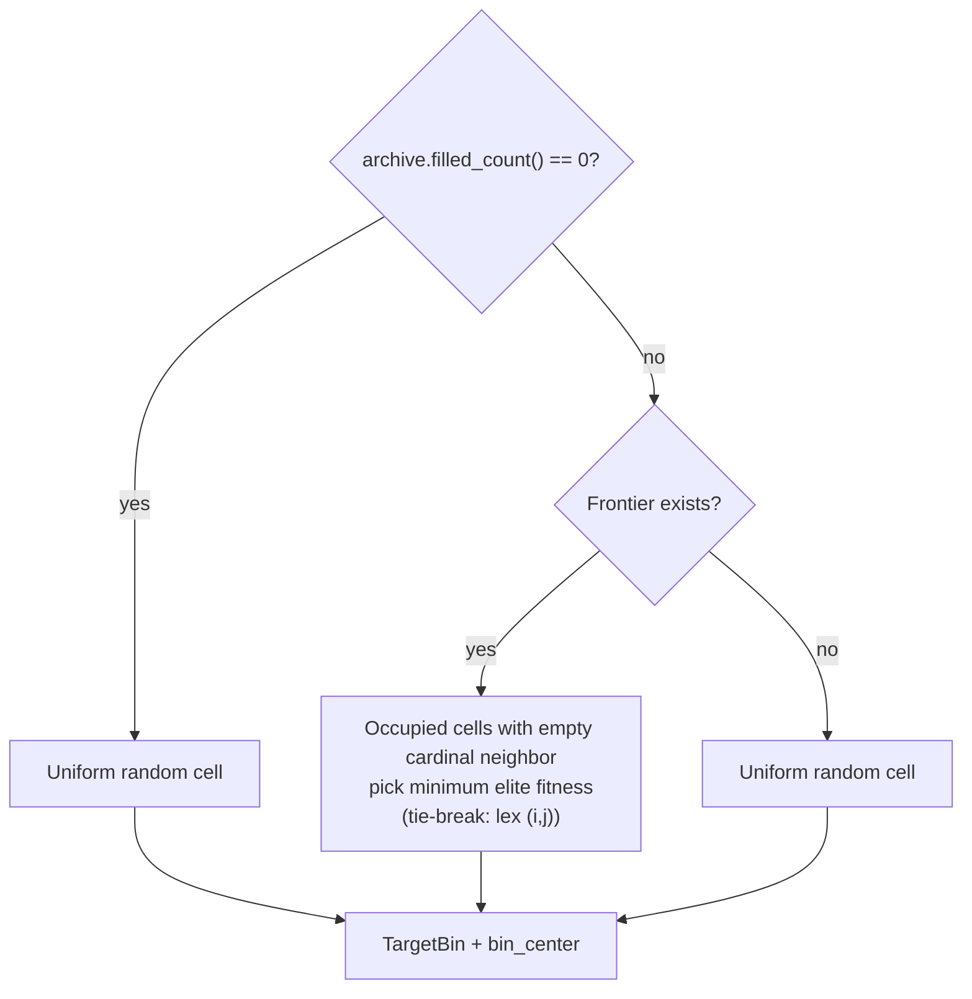
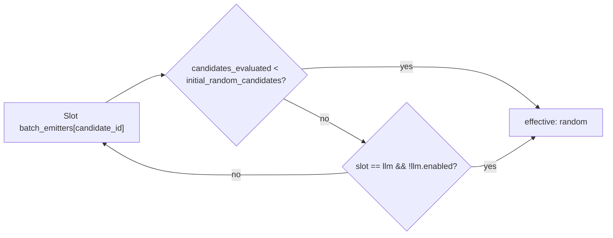
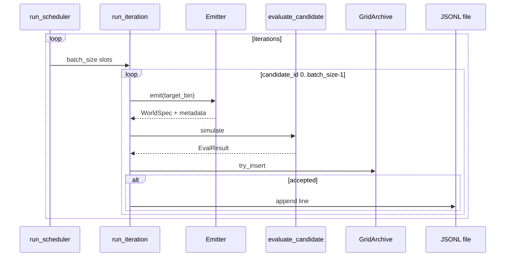

# MAP-Elites in LifeManifold

This guide is for readers who are **new to this repository** and **do not need prior knowledge of MAP-Elites**. It covers the algorithm idea, how it is implemented in `worldspace/illuminators/`, input/output data structures, and state-transition diagrams.

Related material:

- [`docs/WORLDSPACE.md`](WORLDSPACE.md) — simulator, `WorldSpec`, 12 behavioral metrics
- [`docs/SURROGATE_MODEL.md`](SURROGATE_MODEL.md) — surrogate (LLM hints, training buffer)
- [`docs/FORMULAS.md`](FORMULAS.md) — `compute_fitness`, BC metrics, coefficients
- [`docs/ARCHITECTURE.md`](ARCHITECTURE.md) — `worldspace` package map and execution paths

---

## 1. MAP-Elites in plain language

**Quality-Diversity (QD)** means searching not for a single “best” point, but for a **collection** of solutions that are each strong **in their own niche**.

**MAP-Elites** stores that collection on a **discrete grid** (the archive):

| Concept | In LifeManifold |
| --- | --- |
| **Candidate** | One `WorldSpec` — CA rules + noise/resource parameters |
| **Evaluation** | Full simulation `run_world` → metrics |
| **Behavioral coordinates (BC)** | Grid axes: `stability`, `diversity` ∈ [0, 1] |
| **Cell (bin, niche)** | Index pair `(i, j)` on a `resolution × resolution` grid |
| **Fitness (quality)** | Scalar “how interesting is this world” **within its cell** |
| **Elite** | Best candidate in a cell so far |

Archive rule: **at most one elite per cell**. A new candidate is placed by **measured** behavior (BC), not by the emitter’s intended target niche.



**Difference from ordinary optimization:** two worlds with similar fitness but different `(stability, diversity)` can **both** remain in the archive — in different cells.

---

## 2. What the illuminator does in this project

The package `worldspace/illuminators/` is a **separate** pipeline from legacy `python -m worldspace --generator ...` (PCA + k-means on one batch of worlds).



**One run** schedules `iterations × batch_size` **slots**. Each slot:

1. Generates a candidate (emitter).
2. Optionally runs surrogate acquisition (`off` / `shadow` / `filter`); under `filter`, some slots skip simulation.
3. Otherwise runs the CA (`evaluate_candidate` → `run_world`).
4. Computes BC, fitness, bin.
5. Tries to insert into the archive (strict fitness improvement per cell).
6. On accept — appends a JSONL line; on real eval with surrogate enabled — a buffer line.

When acquisition is `off`, the number of simulations equals `iterations × batch_size`.

Entry point: `MapElitesIlluminator.run()` (`worldspace/illuminators/illuminator.py`).

CLI:

```bash
python -m worldspace --illuminator mapelites \
  --scheduler worldspace/specs/map_elites_scheduler.yaml \
  --output-dir output/map_elites \
  --seed 0 --grid 50 --steps 200
```

(`python -m worldspace.illuminators` is an equivalent entry.)

`--steps` ≥ 200 (`ILLUMINATOR_MIN_STEPS`).

---

## 3. Glossary (code ↔ meaning)

| Term | Module / type | Meaning |
| --- | --- | --- |
| `WorldSpec` | `worldspace/specs/spec.py` | Static world description (rules + scalars + `grid_size`, `steps`) |
| `SchedulerConfig` | `illuminators/scheduler.py` | Run parameters from YAML |
| `TargetBin` | `scheduler.py` | Target cell + niche center `(target_stability, target_diversity)` for the emitter |
| `EmitterOutput` | `emitters/base.py` | Candidate before canonical seed + `EliteMetadata` |
| `EvalResult` | `illuminators/evaluation.py` | Result of one simulation |
| `ArchiveElite` | `illuminators/archive.py` | In-memory elite |
| `GridArchive` | `archive.py` | `resolution²` cell grid |
| `CvtArchive` | `cvt_archive.py` | `n_centroids` Voronoi niches in BC `[0,1]²` |
| `ArchiveProtocol` | `archive_protocol.py` | Shared API for grid and CVT |
| `InsertResult` | `archive.py` | `accepted` / `improved` / `rejected` |
| `RunCounters` | `scheduler.py` | `candidates_evaluated` — total simulations so far |
| BC | — | Behavioral characteristics: here `stability`, `diversity` |
| Canonical seed | `evaluation.py` | `seed` from SHA-256 of canonical `WorldSpec` JSON (without the seed field) |

**Important:** archive fitness is **not** `mo_eoc_indicator` from GA/LLM generators. The illuminator uses its own formula (`compute_fitness`).

---

## 4. Behavioral grid (archive)

### 4.1 Axes and size

- Axes: **stability** (axis `i`), **diversity** (axis `j`).
- BC range: **[0, 1]** (`BC_MIN`, `BC_MAX`).
- Size: `grid_resolution × grid_resolution` (default **50×50 = 2500** cells).
- Bin edges: uniform split `np.linspace(0, 1, resolution + 1)`.

Cell index: `bin_index(stability, diversity, resolution)` → `(i, j)`.

Niche center for emitter hint: `bin_center(i, j, resolution)`.



### 4.2 Fitness (quality within a cell)

`compute_fitness` (`evaluation.py`):

- If **early extinction** (`early_extinct`): `fitness = 0.0`.
- Otherwise (terms clipped to [0, 1] where noted):
  - **0.45** × `diversity`
  - **0.25** × `(1 - extinction_probability)` — penalty for an empty final field
  - **0.20** × `oscillation_score`
  - **0.10** × `topology_complexity` (mean of topology proxies)

`extinction_probability = clip(1 - mean(final_life), 0, 1)`.

**Early extinction:** if at timestep `t` with `0 <= t < early_extinction_step` (default **200**) mean life density becomes 0, simulation stops (`early_extinct=True`).

### 4.3 Cell insert rule



| Cell state | Condition | `InsertResult` | JSONL |
| --- | --- | --- | --- |
| Empty | `current is None` | `accepted`, not `improved` | Yes |
| Occupied, better | `fitness_new > fitness_old` | `accepted`, `improved` | Yes |
| Occupied, not better | otherwise | `rejected` | No |

Comparison is **strict** (`>`). Equal fitness in one iteration keeps the **first** accepted entry (fixed slot order `candidate_id` 0…`batch_size-1`).

### 4.4 CVT archive (schema 1.3)

Dual-mode archives: **`grid`** (default, schema 1.2) or **`cvt`** (schema 1.3). CVT replaces uniform bin edges with **Voronoi niches** around fixed centroids in `(stability, diversity)` space.

| | Grid | CVT |
| --- | --- | --- |
| Scheduler | `grid_resolution` (root or `archive.resolution`) | `archive.n_centroids`, `cvt_seed`, `lloyd_iterations` |
| Cell ID | `(i, j)` → flat `cell_id = i * resolution + j` | `cell_id ∈ [0, n_centroids)` |
| Assign BC | `bin_index(stability, diversity, resolution)` | nearest centroid (`assign_cell_id`) |
| Neighbors | Cardinal / Moore on grid | Voronoi adjacency graph |
| Extra artifact | — | `cvt_centroids.json` next to JSONL |



Scheduler example (`worldspace/specs/map_elites_scheduler_mini_cvt.yaml`):

```yaml
schema_version: "1.3"

archive:
  type: cvt
  n_centroids: 25
  cvt_seed: 0
  lloyd_iterations: 50
```

**Backward compatibility:** `schema_version: "1.2"` without an `archive` block behaves exactly as before (`grid`, `grid_resolution` on YAML root). Schema **1.3** may use either `archive.type: grid` or `archive.type: cvt`.

**Resume (CVT):** load collapsed JSONL **and** reuse `cvt_centroids.json` from the same output directory; centroids are fixed at run start from `cvt_seed`.

**Coverage:** `filled_cells / n_cells` where `n_cells = resolution²` (grid) or `n_centroids` (CVT).

---

## 5. State graph for one candidate (batch slot)

Each slot is a linear pipeline — simulation is never skipped:



Order in code (`loop.py`, `run_iteration`):

1. `emitter_kind = resolve_emitter_for_slot(...)` — initial random phase and `llm.enabled`.
2. `target = select_target_bin(archive, rng)`.
3. `output = emitter.emit(...)` → `WorldSpec` + `EliteMetadata`.
4. `_prepare_world_spec` — apply CLI `grid_size`, `steps ≥ min_steps`.
5. `evaluate_candidate` — canonical seed, simulation, measures, fitness, bin.
6. `append_eval_to_buffer` (if buffer provided).
7. `insert_and_persist` → archive + JSONL when `accepted`.
8. `counters.record_evaluation()`.

**Two RNG sources:**

| RNG | Source | Used for |
| --- | --- | --- |
| Global | CLI `--seed` → `np.random.default_rng(seed)` | Target bin, emitters, genetic crossover |
| Canonical | SHA-256 of `WorldSpec` | Reproducible simulation for a given rule |

Emitters output `seed=0`; canonical seed is set before simulation.

---

## 6. Full run state graph



**Resume** (`--load-archive`):

- JSONL is collapsed: per bin, elite with **maximum** fitness (on tie — first line in file).
- If archive is **non-empty**, `candidates_evaluated` is set to `initial_random_candidates` so the “random only” fill phase is **not** repeated from scratch.

---

## 7. Target cell selection (`select_target_bin`)

The emitter receives a **niche hint** `(target_stability, target_diversity)` — center of bin `(i, j)`. The candidate’s actual bin is determined **only** after simulation.



**Frontier** — occupied cells with at least one **empty** **cardinal** neighbor (grid boundary, no torus). This encourages filling empty niches next to known ones.

---

## 8. Scheduler and emitters

### 8.1 Scheduler YAML (input)

Files in `worldspace/specs/`:

| File | Purpose |
| --- | --- |
| `map_elites_scheduler.yaml` | Production: `iterations: 10000`, `batch_size: 50`, LLM on |
| `map_elites_scheduler_mini.yaml` | CI: 20×4 evals, `llm.enabled: false` |
| `map_elites_scheduler_nightly.yaml` | Nightly phase 1, surrogate off; `parallel_eval: true` |
| `map_elites_scheduler_nightly_surrogate.yaml` | Nightly phase 3, surrogate on; `parallel_eval: true` |

Example structure (schema **1.2**):

```yaml
schema_version: "1.2"
iterations: 10000
batch_size: 50
grid_resolution: 50
early_extinction_step: 200
min_steps: 200

batch_emitters:          # length MUST equal batch_size, fixed order
  - random               # 20 slots
  - genetic              # 20 slots
  - llm                  # 10 slots

initial_random_candidates: 100

genetic:
  mutation_scale: 0.02

llm:
  enabled: true

surrogate:
  enabled: false
  model_type: mlp
  checkpoint: artifacts/surrogate/checkpoints/latest.pkl
  buffer_path: artifacts/surrogate/buffer.jsonl
  stub_mean: 0.5
  stub_uncertainty: 1.0

# Optional simulator fast paths (default: all off — standard numpy simulator).
# performance:
#   numba_simulator: false
#   numba_cache: true
#   parallel_eval: false
#   parallel_workers: 0        # 0 = all CPUs (auto); e.g. 4 to cap workers
#   verify_against_reference: false
```

**Performance flags** (optional `performance` block; not the dashboard `config.yaml` section):

| Key | Default | Effect |
| --- | --- | --- |
| `numba_simulator` | `false` | Fused numba step in `run_world` (off = numpy) |
| `numba_cache` | `true` | `@njit(cache=True)` when numba is enabled |
| `parallel_eval` | `false` | Parallel `evaluate_candidate` batch in `run_iteration` |
| `parallel_workers` | `0` | Worker count when `parallel_eval` is on; `0` = `os.cpu_count()` (auto), always capped by `batch_size` |
| `verify_against_reference` | `false` | Dual-run numpy vs numba and assert metrics equal |

Environment overrides (win over YAML): `LIFEMANIFOLD_NUMBA_SIM`, `LIFEMANIFOLD_PARALLEL_EVAL`, `LIFEMANIFOLD_VERIFY_SIM` (`0`/`1`). Per-step `ca_step_trace` in the legacy pipeline always uses numpy regardless of `numba_simulator`.

Numba is an optional dependency: `uv sync --group perf`. First run with `numba_simulator: true` may spend ~1–2 s on JIT compile when `numba_cache: true` (cached on disk thereafter).

`parallel_eval: true` uses a `forkserver` process pool reused across iterations via ``parallel_eval_context`` in ``run_scheduler``. Pass the same pool to ``evaluate_batch_parallel``; do not create a pool per batch. First parallel batch may pay one-time worker import cost (numpy/torch); simulations themselves are deterministic and match sequential runs when acquisition is off.

`numba_simulator` and `parallel_eval` cannot both be `true`: numba JIT in the main process before `forkserver` can deadlock LLVM threads. Use one or the other. `verify_against_reference` tolerates float ULP drift (`atol=1e-12`) between numpy and numba metrics.

**Emitter overrides by phase:**



### 8.2 Emitter types

| `emitter_kind` | Class | Behavior |
| --- | --- | --- |
| `random` | `RandomEmitter` | Independent random `WorldSpec` |
| `genetic` | `GeneticEmitter` | Parents from archive, crossover + Gaussian mutation (21 genes), `mutation_scale` from YAML |
| `llm` | `LlmEmitter` | LLM JSON patch → `WorldSpec`; on failure — one `RandomWalk` step from parent (`emitter_type`: `llm` or `llm_fallback`) |

`MapElitesEmitter` routes each slot to one of the three emitters.

Prompts: `prompts/map_elites_llm_emitter_*.txt`, built in `illuminators/emitters/llm_prompts.py`.

---

## 9. Input data structures

### 9.1 `WorldSpec` (candidate)

See [`WORLDSPACE.md` §3](WORLDSPACE.md). For MAP-Elites additionally:

- Before evaluation: `cell_types = ["life", "food"]`, `seed` cleared by emitter.
- After `apply_canonical_seed`: deterministic `seed` from rules.
- `steps` ≥ scheduler `min_steps` (and CLI `--steps`).

### 9.2 `SchedulerConfig` (in memory after YAML)

| Field | Type | Meaning |
| --- | --- | --- |
| `iterations` | int | Number of batches |
| `batch_size` | int | Slots per iteration |
| `grid_resolution` | int | Archive side length |
| `early_extinction_step` | int | Early extinction threshold |
| `min_steps` | int | Minimum CA steps (≥ 200) |
| `batch_emitters` | tuple | Length = `batch_size` |
| `initial_random_candidates` | int | First N evals forced to `random` |
| `llm_enabled` | bool | Else `llm` slots → `random` |
| `surrogate_*` | — | Buffer, checkpoint, prompt stubs |

### 9.3 CLI (`cli_mapelites.py`)

| Argument | Default | Role |
| --- | --- | --- |
| `--illuminator mapelites` | — | Enable mode |
| `--scheduler` | `map_elites_scheduler.yaml` | YAML path |
| `--output-dir` | `output` | Archive directory |
| `--seed` | 0 | Global RNG |
| `--grid-resolution` | 50 | Archive size |
| `--iterations` | from YAML | Override |
| `--load-archive` | — | Resume JSONL |
| `--archive-type` | — | Override `archive.type` (schema 1.3 only) |
| `--grid`, `--steps` | shared with legacy CLI | Field size and run length |

---

## 10. Output data structures

### 10.1 `map_elites_archive.jsonl`

Path: `{output_dir}/map_elites_archive.jsonl`. Schema **`1.2`** (grid, default) or **`1.3`** (grid or CVT). One JSON line = one **accepted** insert (improvement or first in cell).

#### Schema 1.2 (grid)

Example record:

```json
{
  "schema_version": "1.2",
  "bin": [12, 34],
  "world_spec": {
    "birth": [3],
    "survival": [2, 3],
    "noise": 0.01,
    "resource_regen": 0.02,
    "predation": 0.3,
    "cell_types": ["life", "food"],
    "neighborhood": "moore",
    "grid_size": 50,
    "steps": 200,
    "seed": 2847561203
  },
  "fitness": 0.612,
  "measures": {
    "stability": 0.71,
    "diversity": 0.42
  },
  "metrics": {
    "entropy": 0.55,
    "stability": 0.71,
    "average_lifespan": 4.2,
    "density_mean": 0.18,
    "oscillation_score": 0.33,
    "diversity": 0.42,
    "mo_eoc_indicator": 1.8,
    "topology_interface_index": 0.21,
    "topology_window_heterogeneity": 0.15,
    "compressibility_score": 0.04,
    "ecology_state_entropy_norm": 0.62,
    "ecology_resource_adjacency": 0.11
  },
  "metadata": {
    "id": "550e8400-e29b-41d4-a716-446655440000",
    "parent_id": "a1b2c3d4-...",
    "generated_by": "genetic",
    "emitter_type": "genetic",
    "timestamp": "2026-05-21T12:00:00+00:00",
    "prompt_version": ""
  }
}
```

``prompt_version`` is always a JSON **string**: empty ``""`` for non-LLM emitters, prompt hash for LLM rows. Do not write ``null`` (breaks NDJSON schema inference in dashboard Polars reads).

| Field | Required | Purpose |
| --- | --- | --- |
| `bin` | yes (1.2 grid) | `[i, j]` — cell from **actual** measures |
| `world_spec` | yes | Elite; `seed` is already canonical |
| `fitness` | yes | Archive fitness |
| `measures` | yes | BC for visualization / resume |
| `metrics` | no | Full 12D vector if present |
| `metadata` | yes | Lineage, UUID, timestamp |

#### Schema 1.3 (grid or CVT)

Grid records add `archive_type: "grid"`, `cell_id`, and keep `bin: [i, j]` for compatibility. CVT records use `archive_type: "cvt"` and `cell_id` only (no `bin`).

```json
{
  "schema_version": "1.3",
  "archive_type": "cvt",
  "cell_id": 42,
  "world_spec": { "...": "..." },
  "fitness": 0.71,
  "measures": { "stability": 0.55, "diversity": 0.68 },
  "metadata": { "...": "..." }
}
```

#### `cvt_centroids.json` (CVT runs only)

Written at run start to `{output_dir}/cvt_centroids.json`:

```json
{
  "n": 25,
  "centroids": [[0.12, 0.34], [0.56, 0.78]]
}
```

Dashboard and resume logic join elites on `cell_id` using this file.

| Field | Required | Purpose |
| --- | --- | --- |
| `schema_version` | yes | `"1.2"` or `"1.3"` |
| `archive_type` | 1.3 | `"grid"` or `"cvt"` |
| `cell_id` | 1.3 | Flat niche index |
| `bin` | grid | `[i, j]` from **actual** measures |

**Collapse on resume:** `load_and_collapse_jsonl` — max fitness per niche (`bin` for grid, `cell_id` for CVT); on tie — first line in file.

### 10.2 `EvalResult` (in-process, not a file)

| Field | Type | Description |
| --- | --- | --- |
| `world_spec` | `WorldSpec` | After canonical seed |
| `metrics` | `WorldMetrics` | 12 scalars |
| `measures` | `dict` | `stability`, `diversity` |
| `fitness` | `float` | For archive |
| `bin` | `(int, int)` | Cell indices |
| `early_extinct` | `bool` | Stopped due to extinction |

### 10.3 `nightly_run_summary.json`

Written by `illuminators/nightly_report.py` next to the archive after a nightly run:

| Field | Meaning |
| --- | --- |
| `evaluations` | `iterations × batch_size` |
| `filled_cells` | Occupied cells after collapse |
| `archive_type` | `"grid"` or `"cvt"` |
| `n_cells` | `resolution²` or `n_centroids` |
| `coverage` | `filled_cells / n_cells` |
| `jsonl_raw_lines` | Lines in JSONL (≥ collapsed cells) |
| `llm_enabled`, `surrogate_enabled` | Scheduler flags |
| `archive_jsonl` | Absolute path to archive |
| `llm_stack_version` | Stack audit label (e.g. `"v2"`) when LLM enabled |
| `llm_model`, `max_tokens`, `prompt_version` | LLM spec / prompt hashes |
| `llm_parallel_emit`, `llm_parallel_workers` | Parallel HTTP emit (workers = LLM slots/batch) |
| `llm_emit_attempts`, `llm_emit_fallbacks`, `llm_fallback_rate_pct` | Runtime emit counters |
| `emit_llm_seconds`, `eval_seconds` | Wall time split (emit vs eval/sim) |

Root `nightly_pipeline_summary.json` (two-phase `make nightly-map-elites`) aggregates baseline + surrogate + training.

### 10.4 Surrogate buffer (side output)

Each evaluation (when `surrogate.enabled: true`) → one line in `surrogate.buffer_path` (see [`SURROGATE_MODEL.md`](SURROGATE_MODEL.md)):

```json
{
  "feature_schema_version": "2.0",
  "emitter_type": "genetic",
  "features": [0, 1, 0, "..."],
  "targets": {
    "stability": 0.71,
    "diversity": 0.42,
    "oscillation_score": 0.33,
    "topology_interface_index": 0.21,
    "topology_window_heterogeneity": 0.15,
    "final_density": 0.18,
    "early_extinction_prob": 0.82
  },
  "world_spec": {
    "birth": [1, 3],
    "survival": [2, 3],
    "noise": 0.02,
    "resource_regen": 0.05,
    "predation": 0.1,
    "cell_types": ["life", "food"],
    "grid_size": 50,
    "steps": 200,
    "seed": 12345678
  },
  "metadata": {}
}
```

(`features` length 24 under schema **2.1**, or 21 under legacy **2.0**; `world_spec` required for train/migrate.)

The surrogate does **not** replace archive `fitness` for evaluated candidates. With `acquisition.mode: filter`, some candidates are never simulated (see [`SURROGATE_MODEL.md`](SURROGATE_MODEL.md) §8). LLM prompt hints use the surrogate when `surrogate.enabled: true`.

### 10.5 `MapElitesRunResult`

| Field | Meaning |
| --- | --- |
| `iterations` | From config |
| `evaluations` | `iterations × batch_size` |
| `filled_cells` | `archive.filled_count()` |
| `archive_jsonl_path` | Path to JSONL |
| `counters` | Final `RunCounters` |

---

## 11. Iteration and batch (sequence diagram)



**Per-iteration stats** (`IterationStats`): `evaluations`, `accepted`, `improved`, `rejected` — for one batch.

---

## 12. Nightly pipeline

`make nightly-map-elites` → `worldspace/scripts/run_map_elites_nightly.py`:


Each `make nightly-map-elites` run picks **grid** or **CVT** from the **UTC calendar day** (cron `0 3 * * *`): odd days (1, 3, 5, …) → grid; even days (2, 4, 6, …) → CVT. Both use `n_cells=2500`.

Artifacts per run: `artifacts/map_elites_nightly/{grid,cvt}/baseline/`, `.../surrogate/`, plus `nightly_pipeline_summary.json`. Override: `--archive-type grid|cvt`.

---

## 13. Differences from “textbook” MAP-Elites

| Topic | Classic MAP-Elites | LifeManifold |
| --- | --- | --- |
| Genotype | Bits, neural net, … | `WorldSpec` (CA rules + scalars) |
| Evaluation | Environment / task | `run_world` — stochastic CA |
| BC | Arbitrary descriptors | Fixed: `stability`, `diversity` |
| Fitness | Task reward | Custom formula + extinction penalty |
| Variation | Genome mutation | random / genetic / LLM via **YAML slots** |
| Grid | Often 1D or few axes | Up to 50×50, JSONL + resume |
| Surrogate | Optional | Buffer + LLM hints; optional `shadow`/`filter` acquisition |

---

## 14. Module map

```
worldspace/illuminators/
  illuminator.py      # MapElitesIlluminator.run
  loop.py             # run_iteration, run_scheduler
  scheduler.py        # YAML, select_target_bin, emitter resolve
  evaluation.py       # evaluate_candidate, fitness, binning
  archive.py          # GridArchive, JSONL 1.2
  nightly_report.py   # nightly_run_summary.json
  emitters/
    base.py           # MapElitesEmitter, EmitterOutput
    random_emitter.py
    genetic_emitter.py
    llm_emitter.py
    llm_prompts.py
worldspace/cli_mapelites.py
worldspace/specs/map_elites_scheduler*.yaml
tests/test_map_elites_*.py
.github/workflows/map_elites_smoke.yml
```

**Smoke test:** `make smoke-map-elites` — mini scheduler, no LLM, artifacts under `artifacts/map_elites_smoke/`.

**GitHub LLM special:** workflow `.github/workflows/map_elites_llm_special.yml` — **120×50** evals by default (20 LLM slots/batch, fresh archive), fits ~6h GHA limit; profile **full** = 650 iter (usually needs local: `--iterations 650`). Surrogate: `nightly_v3_mc_d005.pkl` (LLM hints stub unless `hints_ok` / quality gate passes; env `SURROGATE_REQUIRE_QUALITY_GATE=true`). Secret: `QWEN_API_KEY`.

---

## 15. FAQ

**Why doesn’t target bin match the final bin?**  
Target is a hint for the emitter. The real bin comes from **measured** behavior after simulation.

**Why are there more JSONL lines than `filled_cells`?**  
Each **improvement** in a cell appends a line; collapse keeps the best per bin.

**Can I resume a run?**  
Yes: `--load-archive` + same `grid_resolution`. Initial-random phase is skipped if the archive is non-empty.

**How is MAP-Elites different from `--generator` + pipeline?**  
The pipeline builds a **similarity map** for one batch (PCA/k-means). MAP-Elites accumulates a **global archive** of niches over thousands of evaluations.

---

## See also

- [`docs/WORLDSPACE.md`](WORLDSPACE.md) — simulator and metrics
- [`docs/SURROGATE_MODEL.md`](SURROGATE_MODEL.md) — surrogate in MAP-Elites
- [`docs/FORMULAS.md`](FORMULAS.md) — fitness and metric formulas
- [`docs/ARCHITECTURE.md`](ARCHITECTURE.md) — full `worldspace` overview
