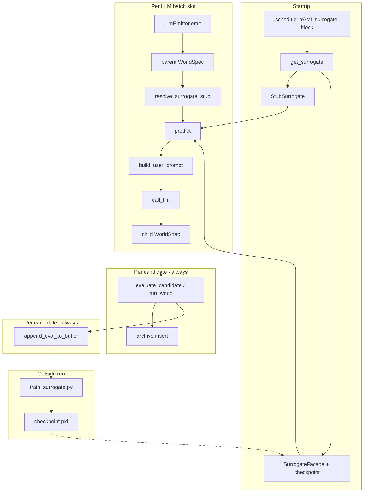

# Surrogate model (LifeManifold + MAP-Elites)

This document explains **what the surrogate is for**, how it fits into the illuminator loop, and **every stage** with explicit inputs and outputs. It describes the **MVP (v1.5)** implementation in `worldspace/surrogate/`.

Related material:

- MAP-Elites core: `docs/MAPELITES.md`, `docs/ARCHITECTURE.md`, `docs/WORLDSPACE.md`, `docs/FORMULAS.md` (§6 fitness)

---

## 1. Goal and role

### 1.1 What problem it solves

`evaluate_candidate()` runs a full cellular-automata simulation (`run_world`) for every MAP-Elites candidate. That is accurate but expensive. A **surrogate** is a fast function that **approximates** the outcome of evaluation from the static `WorldSpec` alone (rules and parameters), without running the simulator.

### 1.2 What the surrogate does in MVP

| Role | Description |
|------|-------------|
| **LLM hint** | Before each LLM emitter call, inject two numbers into the user prompt: expected fitness (`surrogate_mean`) and model uncertainty (`surrogate_uncertainty`). |
| **Training data** | After every real evaluation, append one JSONL row `(features, targets)` for offline retraining. |
| **Future scaling** | Same pipeline (features → predict → fitness) is intended for Surrogate Acquisition (pre-filtering candidates, acquisition). Not active in MVP. |

### 1.3 What the surrogate does *not* do in MVP

- Does **not** skip `evaluate_candidate` or change how many simulations run.
- Does **not** change archive insert logic, RNG, batch slot order, or `map_elites_archive.jsonl` schema.
- Does **not** edit prompt text files under `prompts/` (only placeholder substitution).
- Does **not** replace **archive fitness** (ground truth is always the real simulation).

### 1.4 Two different “fitness” values

| Name | Source | Used for |
|------|--------|----------|
| **Archive fitness** | `evaluate_candidate` → `compute_fitness` on real `WorldMetrics` | `GridArchive.try_insert`, JSONL elites |
| **`surrogate_mean` in prompt** | `resolve_surrogate_stub()` → `prediction.fitness` or YAML stub | LLM user prompt only |

When `surrogate.enabled: false`, prompt numbers are **fixed constants** (`stub_mean`, `stub_uncertainty`), not the parent’s simulated fitness.

---

## 2. End-to-end flow



**Order inside one iteration (one batch slot):**

1. Emitter produces a candidate `WorldSpec` (LLM or other).
2. `evaluate_candidate` runs the **real** simulation → archive fitness.
3. `append_eval_to_buffer` logs features and targets from that **real** result.
4. For **LLM slots only**, step 0 also ran `predict` on the **parent** spec to fill the prompt (before the LLM call).

---

## 3. Stages (inputs and outputs)

### Stage 0 — Configuration

**Where:** `worldspace/specs/map_elites_scheduler*.yaml`, loaded into `SchedulerConfig`, mapped via `surrogate_config_from_scheduler()` to `SurrogateConfig`.

| Input (YAML) | Meaning |
|--------------|---------|
| `surrogate.enabled` | If `false`, prompt uses stubs only; `get_surrogate` returns `StubSurrogate`. |
| `surrogate.model_type` | `lightgbm` or `mlp` (training script; runtime loads pickled `SurrogateModel`). |
| `surrogate.checkpoint` | Path to `SurrogateModel` pickle (e.g. `artifacts/surrogate/checkpoints/latest.pkl`). |
| `surrogate.buffer_path` | Append-only JSONL for training (e.g. `artifacts/surrogate/buffer.jsonl`). |
| `surrogate.stub_mean` | Default prompt fitness hint when surrogate off or model missing (typical `0.5`). |
| `surrogate.stub_uncertainty` | Default prompt uncertainty hint (typical `0.85`–`1.0`). |

| Output | Type | Meaning |
|--------|------|---------|
| `SurrogateConfig` | dataclass | Passed to `get_surrogate()`. |
| `SurrogateProtocol` instance | `StubSurrogate` or `SurrogateFacade` | One instance per illuminator run, shared with `MapElitesEmitter`. |

**Factory (`worldspace/surrogate/__init__.py` → `get_surrogate`):**

| Condition | Output |
|-----------|--------|
| `enabled == false` | `StubSurrogate(stub_mean, stub_uncertainty)` |
| `enabled == true`, checkpoint missing | Same stub |
| `enabled == true`, valid `.pkl` | `SurrogateFacade` via `build_surrogate_facade(model, uncertainty_fallback=stub_uncertainty)` |

---

### Stage 1 — World preparation (emitter + loop)

**Where:** `loop.py` (`_prepare_world_spec`), `LlmEmitter.emit` (parent), `evaluate_candidate`.

| Input | Output |
|-------|--------|
| Emitter `WorldSpec` (often `seed=0` before eval) | `grid_size`, `steps` aligned with run CLI |
| For LLM: parent elite or random fallback | `parent_spec` for surrogate predict |

Canonical seed is applied inside `evaluate_candidate` and again inside `SurrogateFacade.predict` (idempotent).

---

### Stage 2 — Canonical seed

**Where:** `worldspace/illuminators/evaluation.py` → `apply_canonical_seed`, `canonical_seed`.

| Input | Output |
|-------|--------|
| `WorldSpec` (canonical dict: no runtime `seed` in hash input) | `world_spec.seed` set to `sha256(canonical_json)[:8]` as int |
| Same spec + same rules | Same seed every time |

**Requirement:** `feature_extractor.extract()` must run **after** this step. Otherwise `ValueError`.

---

### Stage 3 — Feature extraction

**Where:** `worldspace/surrogate/feature_extractor.py` → `extract(spec)`.

| Input | Output |
|-------|--------|
| Canonicalized `WorldSpec` | `np.ndarray` shape `(8,)`, dtype `float` |

**Feature vector (schema version `"1.0"`):**

| Index | Feature |
|-------|---------|
| 0 | `birth_density` — normalized sum of birth rule integers |
| 1 | `survival_density` — normalized sum of survival rule integers |
| 2 | `noise` |
| 3 | `resource_regen` |
| 4 | `predation` |
| 5 | `grid_size` |
| 6 | `steps` |
| 7 | `seed` (canonical hash seed) |

No randomness in this module (determinism requirement).

---

### Stage 4 — Component prediction (Strategy A)

**Where:** `worldspace/surrogate/model.py` → `SurrogateModel.predict_components`, `predict_uncertainty`.

| Input | Output |
|-------|--------|
| Feature vector `(8,)` | `dict` with **seven** component targets (multi-task regression) |

**Mandatory component keys (`TARGET_KEYS`):**

| Key | Range / role |
|-----|----------------|
| `stability` | BC axis; clipped to [0, 1] in real eval |
| `diversity` | BC axis; clipped to [0, 1] |
| `oscillation_score` | Dynamics; enters fitness |
| `topology_interface_index` | Morphology proxy |
| `topology_window_heterogeneity` | Morphology proxy |
| `final_density` | Final life density proxy |
| `early_extinction_prob` | In [0, 1]; derived from density in training labels |

**Strategy A rule:** the model does **not** expose a separate “fitness head”. Fitness is always derived in the next stage via the same function as the illuminator.

| Input | Output |
|-------|--------|
| Features | `uncertainty` scalar (MVP: ensemble std placeholder; `0.0` triggers fallback) |

---

### Stage 5 — Fitness from prediction

**Where:** `worldspace/surrogate/utils.py` → `compute_fitness_from_prediction`.

| Input | Output |
|-------|--------|
| `SurrogatePrediction` with `components` | `float` fitness in [0, 1] |

Builds a `WorldMetrics`-like struct and calls **imported** `compute_fitness` from `evaluation.py` (formula not duplicated).

**Real fitness formula** (same for archive and surrogate-derived fitness):

```
If early_extinct (life == 0 before step 200): fitness = 0

extinction_probability = clip(1 - final_density, 0, 1)
topology_complexity = clip(0.5 * topology_interface_index + 0.5 * topology_window_heterogeneity, 0, 1)

fitness = clip(
    0.45 * diversity
  + 0.25 * (1 - extinction_probability)
  + 0.20 * clip(oscillation_score, 0, 1)
  + 0.10 * topology_complexity,
  0, 1
)
```

Early extinction in surrogate path: `early_extinction_prob >= 0.5` → `early_extinct=True` in helper.

---

### Stage 6 — Facade predict + cache

**Where:** `worldspace/surrogate/surrogate.py` → `SurrogateFacade.predict`.

| Input | Output |
|-------|--------|
| `WorldSpec` | `SurrogatePrediction` |

**`SurrogatePrediction` fields:**

| Field | Content |
|-------|---------|
| `components` | Seven Strategy A targets |
| `measures` | `stability`, `diversity` (for BC-style readability) |
| `fitness` | From Stage 5 |
| `uncertainty` | Model uncertainty, or `uncertainty_fallback` from config if model returns ≤ 0 |

**LRU cache:** key = `sha256(json.dumps(spec.to_canonical_dict(), sort_keys=True))`. Repeated predict on the same canonical world returns the cached `SurrogatePrediction` without recomputing.

**`StubSurrogate.predict`:** ignores spec content; returns constant `mean` / `uncertainty` for all fields.

---

### Stage 7 — Prompt integration (primary integration point)

**Where:** `scheduler.py` → `resolve_surrogate_stub`, `llm_emitter.py` → `_resolve_surrogate_values`, `build_user_prompt`.

| Input | Output |
|-------|--------|
| `SchedulerConfig`, `SurrogateProtocol`, prepared `parent` `WorldSpec` | `(surrogate_mean, surrogate_uncertainty)` |

| `surrogate.enabled` | Behavior |
|---------------------|----------|
| `false` | `(stub_mean, stub_uncertainty)` — no `predict()` |
| `true` | `(prediction.fitness, prediction.uncertainty)` from `surrogate.predict(parent)` |

**Prompt placeholders** (`prompts/map_elites_llm_emitter_user.txt`):

```
Surrogate predicts fitness ≈ {surrogate_mean:.3f}, uncertainty = {surrogate_uncertainty:.3f}
```

**Meaning for the LLM:**

| Placeholder | Meaning |
|-------------|---------|
| `surrogate_mean` | Approximate interestingness of the **parent** world (not the child being generated). |
| `surrogate_uncertainty` | How much to trust that estimate; high values ask the model to be cautious (see user prompt item 4). |

**Does not add LLM API calls:** one `call_llm` per LLM slot regardless of surrogate on/off.

---

### Stage 8 — Ground-truth evaluation (parallel path)

**Where:** `evaluate_candidate` in `evaluation.py`.

| Input | Output |
|-------|--------|
| Candidate `WorldSpec` | `EvalResult` |

| `EvalResult` field | Source |
|--------------------|--------|
| `world_spec` | Canonicalized spec used in simulation |
| `metrics` | `WorldMetrics` from `run_world` |
| `measures` | `stability`, `diversity` for archive bins |
| `fitness` | **Authoritative** fitness for archive |
| `bin` | `(i, j)` in BC grid |
| `early_extinct` | Whether simulation stopped early |

Surrogate predictions are **never** written into the archive.

---

### Stage 9 — Training buffer (observation)

**Where:** `loop.py` after each `evaluate_candidate`, `buffer.py`.

| Input | Output |
|-------|--------|
| `EvalResult`, `emitter_type` from slot metadata | One queued JSONL record |

**Record schema (one line per evaluation):**

| Field | Type | Source |
|-------|------|--------|
| `feature_schema_version` | string | `"1.0"` |
| `emitter_type` | string | e.g. `random`, `genetic`, `llm`, `llm_fallback` |
| `features` | list[float] | `extract(eval_result.world_spec)` |
| `targets` | object | `targets_from_eval_result(eval_result)` — seven Strategy A keys from **real** metrics |
| `metadata` | object | optional |

**Flush policy:** `SurrogateBuffer` flushes every 32 records and at end of each scheduler iteration / run (`flush_every=32`).

Written for **every** evaluation (insert accept or reject).

---

### Stage 10 — Offline training

**Where:** `scripts/train_surrogate.py`, `worldspace/surrogate/training.py`, `worldspace/surrogate/evaluation.py`.

| Input | Output |
|-------|--------|
| Buffer JSONL path (>= 2000 rows for production) | `feature_matrix` `(N, 8)`, `targets` dict of `(N,)` arrays |
| 80/20 hold-out split (`random_state=42`) | Train fit + hold-out metrics |
| `--model-type lightgbm` | Eight deterministic LightGBM models per Strategy A target |
| `--checkpoint-path` | Pickle file loaded by `get_surrogate` on next run |
| `--micro` | >= 100 rows; writes checkpoint without failing on quality gate |

**Hold-out quality (MVP DoD, full training only):**

| Metric | Threshold |
|--------|-----------|
| `R²(fitness)` | > 0.72 |
| `MAE(fitness)` | < 0.085 |
| `MAE(stability)` | < 0.06 |

Metrics are stored in `latest.summary.json` under `holdout_metrics`.

**Uncertainty after training:** `predict_uncertainty` returns the standard deviation of fitness computed from each ensemble member’s component prediction.

Training is **outside** the illuminator loop; no online weight updates during MAP-Elites.

---

## 4. Module map

```text
worldspace/surrogate/
├── __init__.py          # get_surrogate(), checkpoint load
├── types.py             # SurrogateConfig, SurrogatePrediction, SurrogateProtocol
├── feature_extractor.py # extract(spec) → (8,) vector
├── model.py             # SurrogateModel, TARGET_KEYS, fit / predict_components
├── utils.py             # compute_fitness_from_prediction → evaluation.compute_fitness
├── surrogate.py         # StubSurrogate, SurrogateFacade, LRU cache, build_surrogate_facade
└── buffer.py            # SurrogateBuffer, targets_from_eval_result, append_eval_to_buffer

worldspace/illuminators/
├── scheduler.py         # surrogate_config_from_scheduler, resolve_surrogate_stub
├── loop.py              # buffer hook after each eval
├── illuminator.py       # creates surrogate + buffer for run
└── emitters/
    ├── base.py          # MapElitesEmitter wires surrogate into LlmEmitter
    └── llm_emitter.py   # predict on parent before LLM call
```

---

## 5. Uncertainty (detailed)

| Mode | `surrogate_uncertainty` in prompt |
|------|-----------------------------------|
| `surrogate.enabled: false` | Constant `stub_uncertainty` (not measured) |
| Stub / missing checkpoint | Same |
| `SurrogateFacade` + trained model | `SurrogateModel.predict_uncertainty(features)`; if ≤ 0, use `stub_uncertainty` |

**Intent:** tell the LLM when the surrogate is unreliable so it can avoid over-trusting the fitness hint. It is **not** the variance of repeated simulations.

**Future (Surrogate Acquisition):** ensemble spread across LightGBM models (e.g. eight estimators), calibration, active learning.

---

## 6. Reproducibility and determinism

| Scenario | Expected behavior |
|----------|-------------------|
| `llm.enabled: false` | No LLM calls; surrogate only affects buffer file if run proceeds |
| `surrogate.enabled: false` | Prompt stubs; buffer still grows if illuminator runs |
| Same `WorldSpec`, same deps | `predict()` bit-identical on same platform |
| Archive + archive JSONL with `llm.enabled: false` | Must match with `surrogate` on/off (tests compare fitness, measures, `world_spec`, and JSONL after stripping runtime `metadata.id` / `metadata.timestamp`; buffer path excluded) |

Requirements: fixed `random_state=42` for training; no RNG in feature extractor; canonical JSON for cache keys.

---

## 7. Operational quick reference

**Enable real surrogate hints:**

```yaml
surrogate:
  enabled: true
  checkpoint: artifacts/surrogate/checkpoints/latest.pkl
```

**Train from collected buffer:**

```bash
python scripts/train_surrogate.py \
  --model-type lightgbm \
  --buffer-path artifacts/surrogate/buffer.jsonl \
  --checkpoint-path artifacts/surrogate/checkpoints/latest.pkl
```

**Disable surrogate (stub prompts only):**

```yaml
surrogate:
  enabled: false
  stub_mean: 0.5
  stub_uncertainty: 1.0
```

---

## 8. Surrogate Acquisition

Specification: [`artifacts/SURROGATE_MODEL_TZ_ACQUISITION_v1.0.md`](../artifacts/SURROGATE_MODEL_TZ_ACQUISITION_v1.0.md). Task breakdown: [`artifacts/SURROGATE_EPICS_AND_TASKS_ACQUISITION_v1.1.md`](../artifacts/SURROGATE_EPICS_AND_TASKS_ACQUISITION_v1.1.md).

Implemented in `worldspace/surrogate/`: acquisition policies (`acquisition.py`), loop integration (`illuminators/loop.py`), `SurrogateArchive` JSONL, nested retrain (optional YAML), and **uncertainty calibration** (`calibration.py`).

### 8.1 Calibrated uncertainty (SA-5)

- Offline: `scripts/calibrate_surrogate_uncertainty.py` or `train_surrogate.py --calibrate` → `checkpoints/calibration.pkl`.
- Runtime: `SurrogateFacade.predict` maps raw ensemble spread through isotonic regression fit on hold-out `|pred_fitness - actual_fitness|`.
- Scheduler YAML: `surrogate.calibration: artifacts/surrogate/checkpoints/calibration.pkl`.
- `threshold_gate` and LLM `{surrogate_uncertainty}` use the same calibrated field; missing artifact → raw spread + one warning per process.

Operational notes: [`artifacts/surrogate/README.md`](../artifacts/surrogate/README.md).

### 8.2 Training and acquisition reports (SA-6)

- `train_surrogate.py --consistency-weight 0.1` — optional stability/diversity refinement pass.
- `--acquisition-report` — hold-out replay: `recommended_skip_rate`, `false_skip_rate_estimate`, `calibration_ece`.
- `scripts/report_surrogate_acquisition.py` — metrics only from buffer + checkpoint.
- `scripts/compare_acquisition_runs.py` — A/B eval reduction, filled cells, mean best fitness.

Still planned: optional `ucb_promote` policy.
