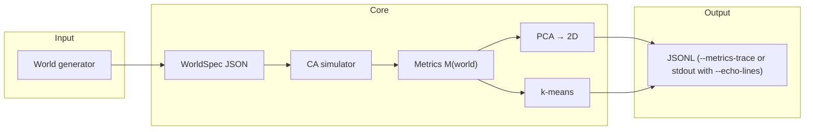
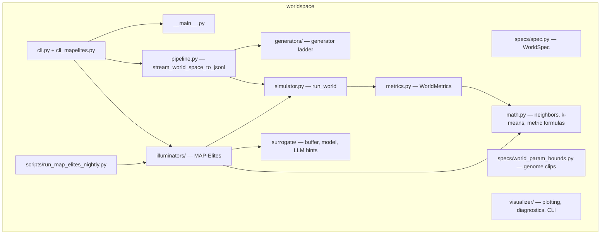
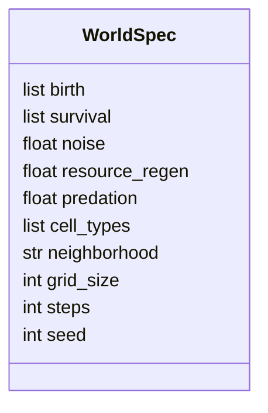
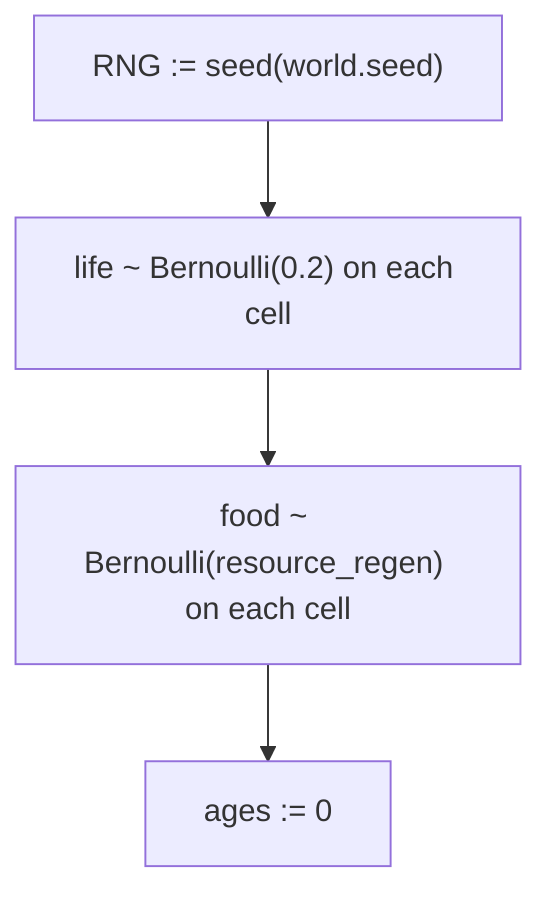
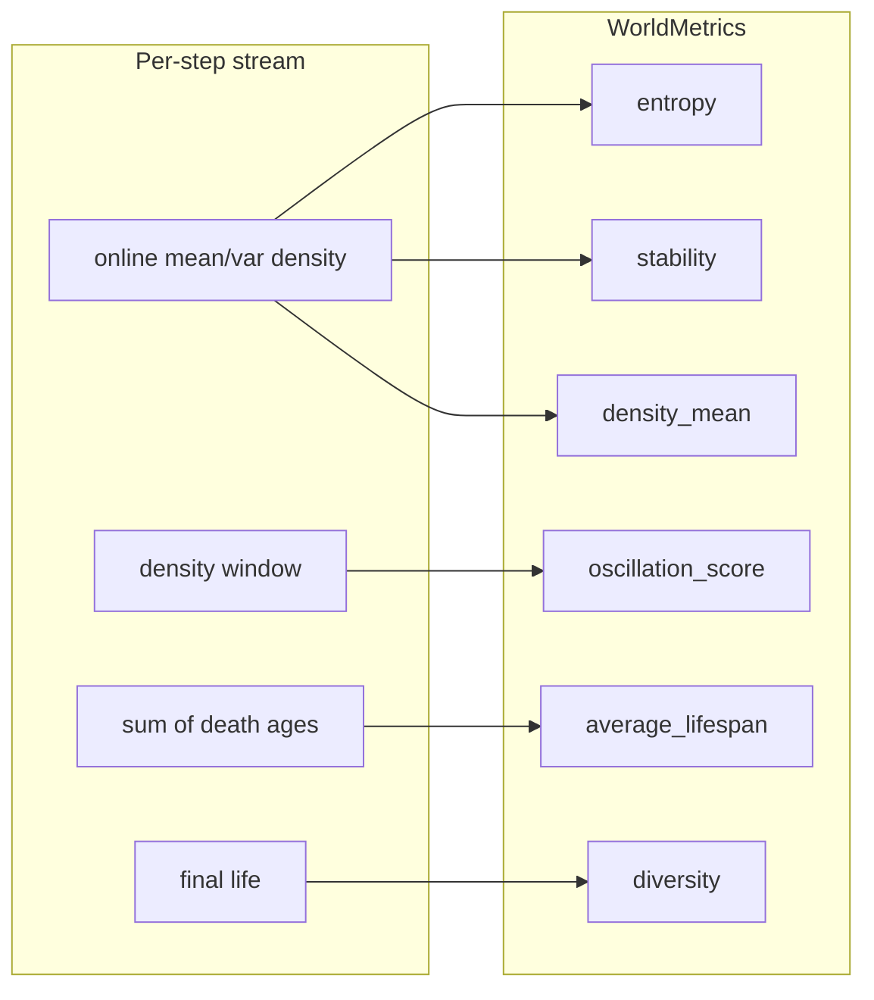
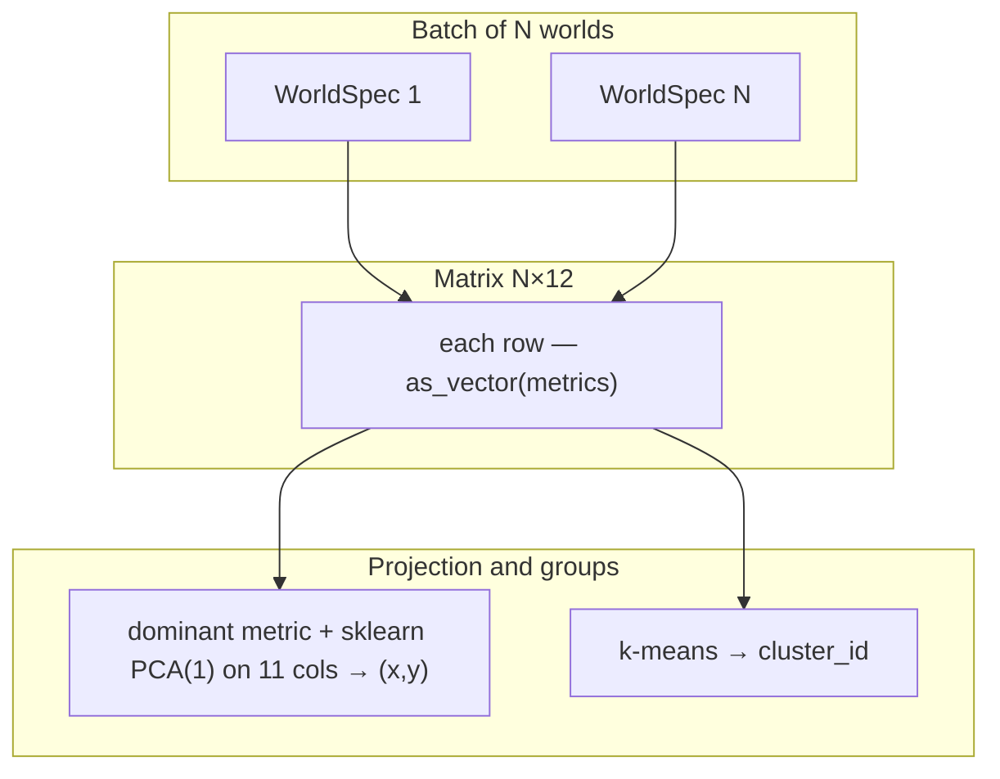
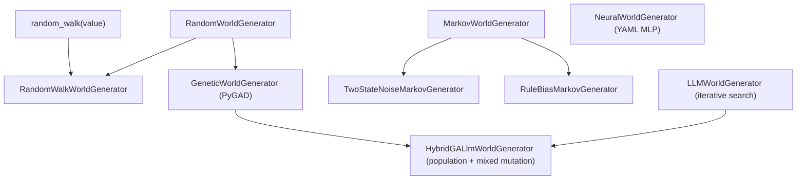

# The `worldspace` package: detailed reference

> Canonical path: **`docs/WORLDSPACE.md`**.

This document describes what the **worldspace** package does, how its parts connect, and what parameters such as **noise** mean in the current implementation. The description is tied to the code in `worldspace/`.

---

## 1. Role of the package

**Goal:** treat a “world” as a point in rule space → run a simple simulation → obtain a numeric “behavioral fingerprint” → project worlds onto a plane and group them.

At a high level, this is the pipeline:



- **WorldSpec** — static description of one world (rules and numeric parameters).
- **run_world** — field dynamics and a **12-dimensional** metrics vector after the run completes (optional per-step JSONL when invoked from the pipeline with `ca_step_trace_*`).
- **stream_world_space_to_jsonl** — two-pass run: PCA/k-means on memmap, JSONL output; a list of `WorldSpec` (one per world) is kept in RAM for pass 2 (small JSON structures; `iter_worlds` is not called twice — important for LLM without duplicate HTTP). The metrics matrix still lives in **memmap** O(1) in the number of worlds for `n ×` **METRICS_VECTOR_DIM** (see `metrics.py`).

The package **does not depend** on legacy application layers (`celery`, `redis`, websockets, etc.) and is intended as a standalone research pipeline.

---

## 2. Module structure



| Module / package | Purpose |
| --- | --- |
| `specs/spec.py` | World dataclass + JSON |
| `specs/world_spec_from_llm.py`, `world_spec_constraints.py`, `world_param_bounds.py` | LLM parsing, validation, shared parameter bounds |
| `generators/` | Random, Markov, genetic, LLM, hybrid, neural generators; YAML in `specs/*_world_generator.yaml` |
| `math.py` | Moore neighbors (torus), k-means on memmap, entropy, oscillation, topology, ecology, compression |
| `simulator.py` | CA; online metrics; optional per-step JSONL (`ca_step_trace_*`) |
| `metrics.py` | `WorldMetrics`, `METRICS_VECTOR_DIM=12`, `mo_eoc_indicator` |
| `pipeline.py` | Two-pass JSONL: dominant-metric-delta + k-means |
| `illuminators/` | Archive, `evaluate_candidate`, scheduler, emitters, loop, `MapElitesIlluminator` |
| `surrogate/` | Features, JSONL buffer, `get_surrogate`, training (see [`docs/SURROGATE_MODEL.md`](SURROGATE_MODEL.md)) |
| `visualizer/plotting.py`, `diagnostics.py` | Scatter/trajectories; single-world dashboard and tertile galleries |
| `visualizer/` | **Deprecated** PNG CLI (`python -m worldspace.visualizer`); use `dashboard/` for archives |
| `cli.py`, `cli_mapelites.py`, `__main__.py` | Legacy `--generator` and `--illuminator mapelites` |
| `scripts/run_map_elites_nightly.py` | `make nightly-map-elites` |

Package architecture overview: [`docs/ARCHITECTURE.md`](ARCHITECTURE.md). This file covers parameter semantics, metrics, and CLI.

---

## 3. Data schema: `WorldSpec`

One world is a **WorldSpec** object, representable as JSON.

### 3.1 Fields and meaning in code

For a per-field usage map (simulator, canonical seed, generators, surrogate, dashboard), see **[`WORLD_SPEC_AUDIT.md`](WORLD_SPEC_AUDIT.md)**.



| Field | Type | Role in the simulator |
| ---------------- | ----------- | ----------------------------------------------------------------------------------------------------------- |
| `birth` | `list[int]` | Number of live Moore neighbors at which a **dead** cell becomes alive |
| `survival` | `list[int]` | Number of live neighbors at which a **live** cell stays alive |
| `noise` | `float` | Probability of a **random flip** of cell state after birth/survival rules (see §4.3) |
| `resource_regen` | `float` | Per-step probability of “food” appearing on a cell + initial food density |
| `predation` | `float` | Intensity of probabilistic death under high neighbor density |
| `cell_types` | `list[str]` | **Declarative list** of types for the spec; the current simulator uses only binary `life` and a `food` layer |
| `neighborhood` | `str` | Default `"moore"` in the spec; only **Moore** with torus is implemented |
| `grid_size` | `int` | Field size N × N |
| `steps` | `int` | Number of time iterations |
| `seed` | `int` | Seed for `numpy.random.Generator` |

Example JSON sample:

```json
{
  "birth": [3],
  "survival": [2, 3],
  "noise": 0.01,
  "resource_regen": 0.02,
  "predation": 0.3,
  "cell_types": ["empty", "life", "food"],
  "neighborhood": "moore",
  "grid_size": 50,
  "steps": 300,
  "seed": 0
}
```

---

## 4. Simulator: what happens each step

The function **run_world(world)** maintains two hidden state fields on the grid:

- **life** — 0 or 1 (dead / alive).
- **food** — 0 or 1 (no food / food present).
- **ages** — age of a live cell in steps (for mean “lifespan” at death).

### 4.1 Initialization



So **20%** of cells are randomly alive at the start (constant in code, not from `WorldSpec`).

### 4.2 Deterministic core (birth / survival)

For each cell, **neighbors** is the count of live **Moore** neighbors (8 cells), with **toroidal** boundaries (`np.roll`).

$$
\text{born}(x,y) = \mathbf{1}[\text{life}=0 \land \text{neighbors} \in \text{birth}]
$$

$$
\text{survive}(x,y) = \mathbf{1}[\text{life}=1 \land \text{neighbors} \in \text{survival}]
$$

$$
\text{nextlife} = \max(\text{born}, \text{survive}) \quad \text{(cell-wise bitwise)}
$$

This generalizes “Game of Life”: the `birth` and `survival` sets define the rule entirely.

### 4.3 What `noise` is

After computing `next_life` from the rules, for **each cell** independently:

- with probability **noise**, the state is **inverted**: 0 ↔ 1.

Formally: if `flip[x,y] ~ Bernoulli(noise)`, then  
`next_life[x,y] := 1 - next_life[x,y]` when `flip` is true.

**Interpretation:** this is not “measurement error” but a **stochastic CA**: random mutations/radiation/micro-fluctuations of rules at the cell level. Higher `noise` pushes the system further from pure Conway-like dynamics.

Generator bounds may differ; in the simulator the value only needs to be a valid probability (usually [0, 1]).

### 4.4 What `predation` is (predation / crowding pressure)

If `predation > 0`:

- `exposure = neighbors / 8.0` — fraction of occupied neighbor cells.
- for live cells after noise: with probability  
**predation × exposure** the cell dies.

So the denser the neighborhood of live cells, the higher the chance of “death from pressure.” This is a coarse competition/predation model without a separate “predator” type.

### 4.5 What `resource_regen` is (resources / food)

Two uses:

1. **Initialization:** starting food map — Bernoulli(`resource_regen`) per cell.
2. **Each step:** for each cell independently, with probability **resource_regen**, `food = 1` is set (food can “grow” on top of existing logic).

Then:

- if **food == 1** and the cell is **alive** after all `next_life` updates, food is consumed (`food := 0`), and **ages** get a **+1 bonus** to age increment on that step (`feed_bonus`).

**Interpretation:** food boosts “survivability” of age in the sense of death metrics (indirectly); a separate “resource” field type does **not** participate in birth rules — only through age and indirectly through dynamics.

### 4.6 Death and age

- If a cell was alive (`life == 1`) and becomes dead (`next_life == 0`), death ages are **summed** into counters (no list of all `death_ages`).
- For live cells: `ages := ages + 1 + feed_bonus`; for dead: `ages := 0`.

### 4.7 Statistics without long lists

Instead of lists over all steps:

- **online mean and variance** of density (Welford) → `density_mean`, `stability`;
- **sum and count** of ages at death → `average_lifespan`;
- **fixed-length deque** (512 latest density values) → `oscillation_score` (autocorrelation estimate on the window, not the full series);
- **one copy** of the final `life` field → `diversity` via `pattern_diversity_from_frame`.


---

## 5. Metrics: vector M(world) ∈ ℝ¹²

**WorldMetrics** are computed **inside run_world** from online accumulators (see §4.7). There is no separate `compute_metrics` function.

| Name | How it is computed in code | Explanation |
| ----------------------- | ------------------------------------------------------------------------------------------------------- | ---------------------------------------------------------------------------------------------------------- |
| **entropy** | Binary Shannon entropy for **density_mean**: H(p) with p = ρ̄_t | Not field pattern entropy, but entropy of “mean occupancy over time” as a Bernoulli fraction |
| **stability** | clip(1 − σ(ρ)/(μ(ρ)+ε), 0, 1) | Low density variance over time → higher stability |
| **average_lifespan** | `death_age_sum / death_count` (no deaths → `0`) | Mean steps until death for cells that died |
| **density_mean** | Online mean density over steps | Mean live occupancy over the run |
| **oscillation_score** | Autocorrelation on a **window** of the last 512 density values | Approximation of “are there cycles” without storing the full series |
| **diversity** | Fraction of unique signatures among **sample_size** random 3×3 patches on the **final** `life` field | Coarse estimate of “how many distinct local patterns” |
| **mo_eoc_indicator** | §5.1, `multi_objective_edge_of_chaos_indicator` in **metrics.py** | **Multi-Objective + Edge-of-Chaos** scalar for GA/LLM/Hybrid (coefficients in §5.1). |
| **topology_interface_index** | `worldspace.math.topology_interface_index(life)` | Fraction of differing torus neighbors (Moore, 8 directions), averaged over cells and divided by 8; in `[0,1]` — **topological / morphological boundary complexity** of the live phase. |
| **topology_window_heterogeneity** | `topology_window_heterogeneity(life)` | Fraction of toroidal `2×2` windows where the four corners **are not all equal**; in `[0,1]` — mesoscale **non-triviality** of the pattern (proxy for local “saddle” / mixing without full persistent homology). |
| **compressibility_score** | `compressibility_score_joint(life, food)` | `1 - len(zlib.compress(raw))/len(raw)` on concatenated `life` and `food` bytes (zlib level 6), in `[0,1]` — **approximate computability / description length**: ordered fields compress more strongly. |
| **ecology_state_entropy_norm** | `ecology_state_entropy_norm(life, food)` | Shannon entropy over classes `code = life + 2*food` (up to 4 classes), normalized by log₂ k for the number of **non-zero** classes; in `[0,1]` — **ecological diversity** of the joint “life + resource” state. |
| **ecology_resource_adjacency** | `ecology_resource_adjacency(life, food)` | Mean over live cells of the fraction of neighbors with `food==1` (Moore, torus); in `[0,1]` — **spatial coupling** of consumers and resource. |

Fixed vector order from **WorldMetrics.as_vector()**:

```text
[entropy, stability, average_lifespan, density_mean, oscillation_score, diversity, mo_eoc_indicator, topology_interface_index, topology_window_heterogeneity, compressibility_score, ecology_state_entropy_norm, ecology_resource_adjacency]
```



### 5.1. Scalar `mo_eoc_indicator` (Multi-Objective + Edge-of-Chaos)

The final value is written to JSON as `metrics.mo_eoc_indicator` and computed in `worldspace.metrics.multi_objective_edge_of_chaos_indicator` after `run_world`. Full coefficient rationale: [**FORMULAS.md §5**](FORMULAS.md). Below, the same notation as in code.

**Inputs (already computed world scalars):**

| Symbol | Field | Range / meaning |
|--------|------|------------------|
| \(H\) | `entropy` | \([0,1]\) — binary Shannon entropy on mean density |
| \(S\) | `stability` | \([0,1]\) |
| \(D\) | `diversity` | \([0,1]\) — fraction of unique patches |
| \(A\) | `oscillation_score` | \(\ge 0\), in practice usually \(\le 1\) (normalized autocorrelation) |
| \(E_{\mathrm{ext}}\) | `extinction_penalty` | \(\mathrm{clip}(1 - \rho_{\mathrm{final}},\,0,\,1)\), where \(\rho_{\mathrm{final}}\) is mean occupancy of the **final** field |

**Derived quantities:**

1. **Entropy curvature (instead of raw \(H\) in the “edge of chaos” band):**  
   \[
   C_H = H(1-H).
   \]  
   On \([0,1]\), \(C_H\) is maximal at \(H=\tfrac12\) (\(C_H^{\max}=\tfrac14\)): the “critical” zone between empty and saturated field, not extremes \(H\approx 0\) or \(H\approx 1\).

2. **Normalize \(C_H\) to \([0,1]\)** (convenient for weights in code):  
   \[
   \widehat C_H = \frac{C_H}{0.25} = 4\,H(1-H).
   \]  
   The formula uses **\(C_H=H(1-H)\)**; the factor \(1/0.25\) only scales the contribution to \([0,1]\).

3. **Activity × persistence (second “edge of chaos” reading — dynamics with non-zero life memory):**  
   \[
   P = \mathrm{clip}\!\left(\frac{\text{average\_lifespan}}{10},\,0,\,1\right),
   \qquad
   C_{AP} = A\cdot P.
   \]  
   \(A\) — “are there density oscillations”; \(P\) — normalized mean lifetime of dead cells (persistence proxy). Their product favors worlds where dynamics and sustained development over steps align.

**Multi-objective base:**

\[
\mathrm{MO} = H + S + D.
\]

**Final formula (exactly as in code):**

\[
\boxed{
\mathrm{mo\_eoc}
=
\mathrm{MO}\cdot\bigl(0{,}50 + 0{,}30\,\widehat C_H + 0{,}20\,C_{AP}\bigr)
+ 0{,}15\,A\,\widehat C_H
+ 0{,}10\,P
- E_{\mathrm{ext}}
}
\]

**Meaning of coefficients:**

- **0.50** — constant share: even at low “curvature” and without \(C_{AP}\), the scalar rests on \(H+S+D\).
- **0.30 \(\widehat C_H\)** inside the bracket — amplifies \(\mathrm{MO}\) when the system is in the entropic middle (\(\widehat C_H\to 1\)); on frozen or trivial regimes (\(\widehat C_H\to 0\)) this multiplier on \(\mathrm{MO}\) falls.
- **0.20 \(C_{AP}\)** — added to the multiplier for “oscillations + survival.”
- **+0.15 \(A\,\widehat C_H\)** — direct bonus to dynamics, **stronger** when normalized curvature \(C_H\) is high (aligned with the “edge of chaos” picture in entropy).
- **+0.10 \(P\)** — small shift toward longer mean life (within the clip).
- **−\(E_{\mathrm{ext}}\)** — penalty for extinction / nearly empty final field (as elsewhere in the project).

The sum of weights inside the bracket at “ideal” \(\widehat C_H=1\), \(C_{AP}=1\) is \(1.00\); at zeros — \(0.50\). This is intentionally **not** convex normalization to \([0,1]\): the scalar stays unbounded above via \(\mathrm{MO}\) and extra terms, which suits **ranking** worlds in GA/population sort.

### 5.2. Topology, compression, and ecology (last five coordinates)

Five additional scalars are computed on the **final** `life` and `food` grids inside `_metrics_from_final_state` (see `worldspace/simulator.py`, functions in `worldspace/math.py`). They extend the world “behavior” vector without entering the `mo_eoc_indicator` formula in §5.1.

- **Topology (approximate, fast):** `topology_interface_index` — normalized boundary density of live/dead phase on the torus; `topology_window_heterogeneity` — fraction of locally non-uniform `2×2` windows. These are **not** Betti numbers or persistent homology: cheap proxies for morphological complexity.
- **Compression:** `compressibility_score` — ratio of zlib-compressed length to raw `life‖food` bytes; reflects **algorithmic simplicity** of the configuration (high score ≈ “short description”).
- **Ecology with two types per cell** (`life` ∈ {0,1}, `food` ∈ {0,1}, as in the simulator): `ecology_state_entropy_norm` — entropy of the joint 4-class distribution; `ecology_resource_adjacency` — how close food is to live cells. `WorldSpec.cell_types` names types in the spec; in the current MVP dynamics remain binary for life plus a separate resource grid.

---

## 6. World space: PCA and clusters

**stream_world_space_to_jsonl(..., metrics_trace_path=..., ca_step_trace_path=...)** (`worldspace/pipeline.py`):

1. **Pass 1:** for each world from **generator.iter_worlds(n)** — **run_world** (metric vector **after the full run** is written to **memmap** `(n × 12)`). The list of **WorldSpec** for all `n` worlds is kept for pass 2 (no second **iter_worlds**, avoiding a second HTTP round for **LLMWorldGenerator**). If **ca_step_trace_path** is set, a file descriptor is passed into **run_world**: on **each CA step** a JSON line is appended with **yield_index**, **ca_step**, **metrics** (only from this pipeline pass).
2. On the batch metrics matrix: **_fit_dominant_metric_orthogonal_pca** — axis **x** as deviation of the metric with **maximum variance** in the batch from its mean; axis **y** — **first principal component of sklearn `PCA(n_components=1)`** fit on the **other 11** columns (sklearn centers those features inside `fit`).
3. **k-means Lloyd** on memmap rows (centroids **k×12**, labels in a separate memmap).
4. **Pass 2:** for index **i**, take **worlds[i]** and the memmap row; 2D layout (**dominant_metric_delta_xy**), **cluster_id**, write **one JSON line** to the main file (if **path** is set) and, with **echo_stdout=True**, to stdout. If **metrics_trace_path** is set, after pass 2 this file gets one line per world: **yield_index** plus the same fields as the main record (`world`, `metrics`, `dominant_metric_delta_xy`, `dominant_metric_delta_axis_labels`, `cluster_id`) — input for **python -m worldspace.visualizer --metrics-jsonl**.

The main JSONL (if **path** in **stream_world_space_to_jsonl**) and lines in **--metrics-trace** after pass 2 contain `world`, `metrics`, `dominant_metric_delta_xy`, `dominant_metric_delta_axis_labels`, `cluster_id`; **--metrics-trace** also has **yield_index**. Temporary metrics memmap is removed when the function finishes. For **n_worlds ≤ 0**, trace files are **not** opened.

### 6.1. Fields `dominant_metric_delta_xy` and `dominant_metric_delta_axis_labels`

This is **not** a neural embedding and **not** the same as **pca.png** / **umap.png** (those reduce **all 12** final metrics).

| Field | Meaning |
|------|--------|
| **dominant_metric_delta_xy** | `[x, y]` — world coordinates: Δ of dominant metric and PC1 of the **other 11** |
| **dominant_metric_delta_axis_labels** | Axis labels: which metric on **x**, text for **y** |

**x-axis:** metric with **highest variance in the current batch** minus its batch mean: “how far the world deviates on the most ‘spread’ metric.”

**y-axis:** **sklearn PC1** on the **other 11** metrics (the x-dominant metric is **excluded** from PCA). Centering only inside `PCA` on those columns (`pca.mean_` — their means). For **n < 2** worlds, **y = 0** for all.

**Point color** on plots: **cluster_id** (k-means Lloyd on the full 12D metric vector in the pipeline) or recomputed k-means in the visualizer (**--k-clusters**).

Legacy traces: the visualizer reads aliases `embedding_2d` / `embedding_axes`, `world_space_xy` / `world_space_axis_labels`. The pipeline writes only `dominant_metric_delta_*`.

**Three scatters from `--metrics-jsonl`:**

| PNG | Geometry |
|-----|-----------|
| **dominant_metric_delta.png** | Δ dominant metric vs PC1 of other 11 (as in trace) |
| **pca.png** | 2D PCA on all 12 metrics |
| **umap.png** | 2D UMAP on all 12 metrics (≥3 worlds) |



**Important:** PCA here applies to **behavior metrics**, not raw `WorldSpec` parameters. This yields a map of “behavioral similarity” that may not match Euclidean distance in rule space.

---

## 7. World generators

The “generator ladder” idea:



- **RandomWorldGenerator** — independent random rules and parameters.
- **RandomWalkWorldGenerator** — sequence of worlds: small random changes from a start world.
- **TwoStateNoiseMarkovGenerator** — hidden “calm / chaotic” state changes noise scale.
- **RuleBiasMarkovGenerator** — bias on `birth`/`survival` sets.
- **GeneticWorldGenerator** — world evolution via PyGAD on `mo_eoc_indicator` fitness (chromosome = rules + scalars).
- **LLMWorldGenerator** — loop `simulate -> score -> LLM patch -> validate/clamp -> next`.
- **HybridGALlmWorldGenerator** — population scheme: selection (top-k + random diversity), then `random mutation` + `LLM-guided mutation`; the LLM sees the top fraction of best worlds.
- **NeuralWorldGenerator** — generation via latent MLP with YAML spec.

### 7.1 Generator YAML configs

- `worldspace/specs/genetic_world_generator.yaml`
- `worldspace/specs/llm_world_generator.yaml`
- `worldspace/specs/hybrid_world_generator.yaml`
- `worldspace/specs/neural_world_generator.yaml`

The CLI supports overriding the YAML path via a single `--generator-spec` flag (with `--generator genetic|llm|hybrid|neural`); file shape is validated for the chosen generator.

---

## 8. CLI and output files

Package entry: `worldspace/__main__.py` → `cli.main()`.

Examples:

```bash
python -m worldspace --generator random --worlds 30 --steps 200 --grid 40
```

Other generator modes:

```bash
python -m worldspace --generator genetic --generator-spec worldspace/specs/genetic_world_generator.yaml
python -m worldspace --generator llm --generator-spec worldspace/specs/llm_world_generator.yaml
python -m worldspace --generator hybrid --generator-spec worldspace/specs/hybrid_world_generator.yaml
python -m worldspace --generator neural --generator-spec worldspace/specs/neural_world_generator.yaml
```

**JSONL** from the CLI: main stream — **--metrics-trace PATH** (one JSON line per world after dominant-metric-delta + k-means: `yield_index`, `world`, `metrics`, `dominant_metric_delta_xy`, `dominant_metric_delta_axis_labels`, `cluster_id`) and/or **--ca-step-trace PATH**. Additionally (any **--generator**):

- **--echo-lines** — print to stdout the same full per-world records as the main pipeline lines when writing via API **path** (without `yield_index`); without this flag and without **--metrics-trace** / **--ca-step-trace**, stdout stays empty.
- **--ca-step-trace PATH** — JSONL: on every **CA step** inside **run_world** for each such world — `yield_index`, `ca_step`, `metrics`. Internal **run_world** calls from generators (e.g. parent evaluation in **LLMWorldGenerator**) are **not** written to this file.

```bash
python -m worldspace --metrics-trace results/trace.jsonl --ca-step-trace results/ca_steps.jsonl
```

To duplicate full per-world records to stdout (without writing a file), set **--echo-lines**.

**Research dashboard (primary, MAP-Elites archives and diagnostics):**

```bash
cd dashboard
streamlit run Home.py
```

See [DASHBOARD.md](DASHBOARD.md).

**Legacy matplotlib CLI (deprecated)** — pipeline metrics / CA-step PNG only:

```bash
uv run python -m worldspace.visualizer \
  --output-dir results/plots \
  --metrics-jsonl results/trace.jsonl \
  --ca-step-jsonl results/ca_steps.jsonl \
  --ca-trace-worlds 0,10,20 \
  --summary
```

From **--metrics-jsonl**: **dominant_metric_delta.png**, **pca.png**, **umap.png** (see §6.1; k-means color). From **--ca-step-jsonl**: **ca_step_timeseries.png**, **pca_trajectories.png**, **umap_trajectories.png**; **--summary** prints **mean/std/min/max** of metrics by **yield_index**.

Plot helpers live in `worldspace.visualizer.plotting` (not re-exported from `import worldspace`).

### 8.1 MAP-Elites (quality-diversity)

Separate mode, not mixed with `--generator`:

```bash
python -m worldspace --illuminator mapelites \
  --scheduler worldspace/specs/map_elites_scheduler.yaml \
  --output-dir output/map_elites \
  --steps 200 --grid 50 --seed 0
```

Archive behavioral coordinates: `stability`, `diversity` (from `WorldMetrics`). **Fitness** for cell insertion — `illuminators/evaluation.py` (`compute_fitness`), not `mo_eoc_indicator`. Each candidate: canonical `seed` from hash of `WorldSpec`, simulation with `early_extinction_step` (default 200), strict improvement `fitness_new > fitness_old` in `GridArchive`.

| Scheduler YAML | Purpose |
| --- | --- |
| `map_elites_scheduler.yaml` | Production: 10000 iterations, LLM enabled |
| `map_elites_scheduler_mini.yaml` | CI smoke (`make smoke-map-elites`) |
| `map_elites_scheduler_nightly.yaml` | Nightly, phase 1: buffer collection, surrogate off |
| `map_elites_scheduler_nightly_surrogate.yaml` | Nightly, phase 3: surrogate on, resume archive |

Output: `{output_dir}/map_elites_archive.jsonl` (schema 1.2). Resume: `--load-archive PATH` (collapse JSONL → in-memory archive).

---

## 9. Surrogate model (brief)

The `worldspace/surrogate/` package speeds up **hints** for the LLM emitter; it does not replace simulation.

| What it does | What it does not do (MVP) |
| --- | --- |
| After each `evaluate_candidate`, appends a line to the JSONL buffer (`features`, `targets`) | Does not skip `run_world` |
| In the LLM user prompt, inserts `surrogate_mean` and `surrogate_uncertainty` | Does not change archive fitness (only real simulation) |

Local artifacts (synthetic buffer): `make surrogate-artifacts` → `artifacts/surrogate/buffer.jsonl`, `checkpoints/micro.pkl`, `checkpoints/latest.pkl` (see `artifacts/surrogate/README.md`). Training: `python scripts/train_surrogate.py` (full mode ≥ 2000 buffer lines; strict schema 2.0; `--micro` for smoke). Nightly pipeline: `make nightly-map-elites` → baseline → migrate/train → `nightly_v2.pkl` → second phase with `surrogate.enabled: true`. Buffer append runs only in the surrogate-enabled phase.

Details: [`docs/SURROGATE_MODEL.md`](SURROGATE_MODEL.md), [`artifacts/surrogate/README.md`](../artifacts/surrogate/README.md).

---

## 10. Limitations and honest caveats

1. **cell_types** and **neighborhood** are mainly for compatibility with “world as JSON” spec; the simulator implements **binary life + food + Moore**.
2. Initial life density is **fixed (20%)** in the simulator code.
3. **entropy** is not configuration entropy of the grid, but a function of **mean density over time**.
4. **diversity** is a sampled heuristic on the last frame, not the full pattern spectrum.
5. **Clustering and PCA** are simplified (teaching MVP); for a serious world map, feature normalization, other dimensionality reduction, and distance choice matter.

---

## 11. Dependencies

The package uses `numpy`, `matplotlib`, `scikit-learn`, `pandas`, `pyyaml`, `pygad`, `torch`, `lightgbm` (see `pyproject.toml`). Install: `uv sync` at the repository root.

Makefile: `make smoke-map-elites`, `make nightly-map-elites`.

---

## See also

- [`docs/ARCHITECTURE.md`](ARCHITECTURE.md) — package map, two execution paths, module layout.
- [`docs/FORMULAS.md`](FORMULAS.md) — all metrics, `mo_eoc_indicator`, MAP-Elites fitness, genome encoding.
- [`docs/MAPELITES.md`](MAPELITES.md) — MAP-Elites: algorithm, schemas, JSONL inputs/outputs.
- [`docs/SURROGATE_MODEL.md`](SURROGATE_MODEL.md) — surrogate: stages, I/O, quality thresholds.
