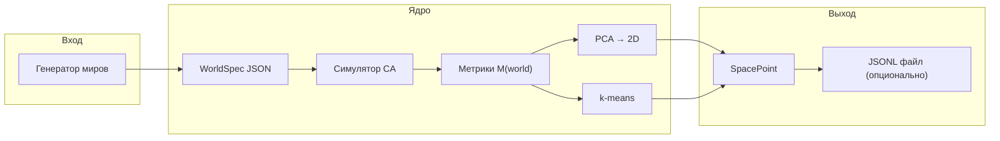
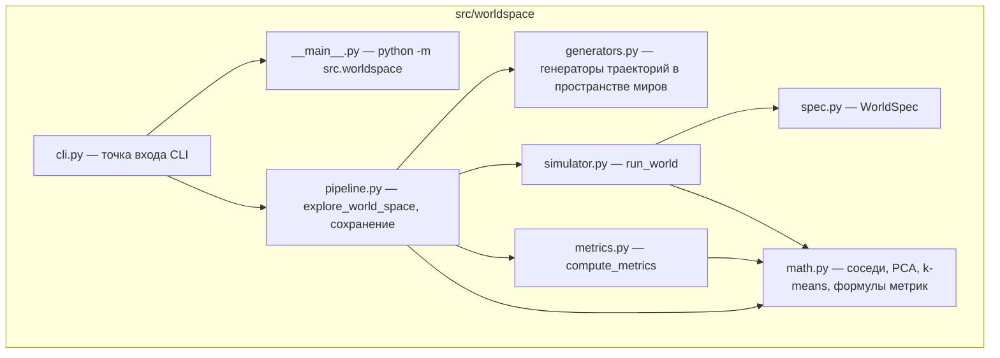
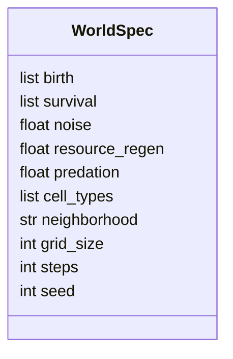
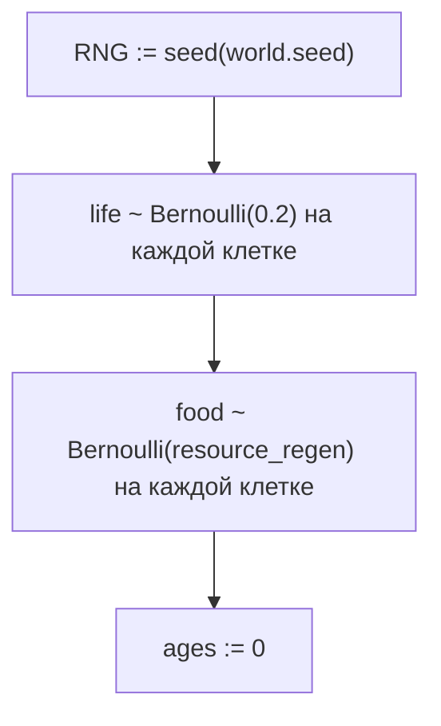
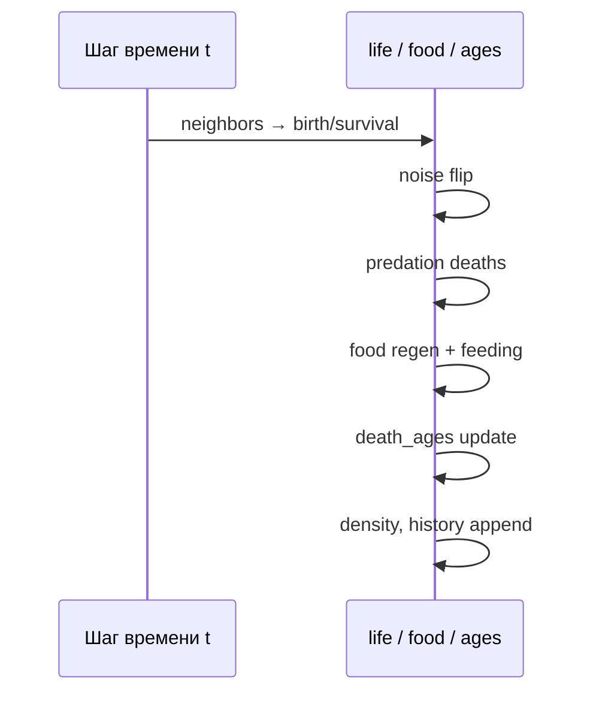
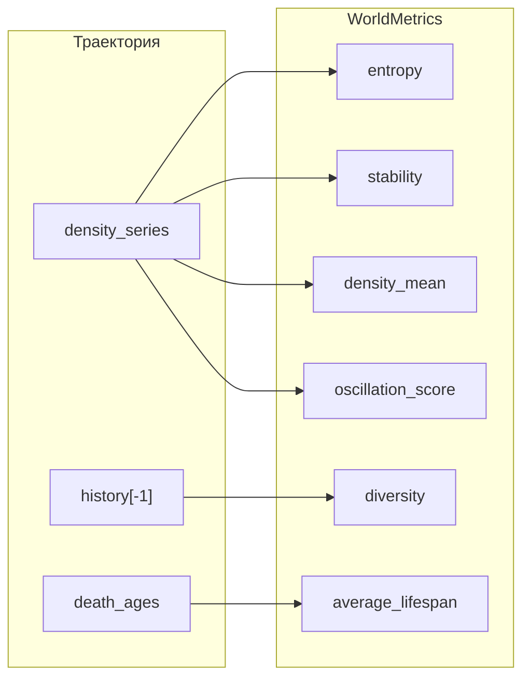
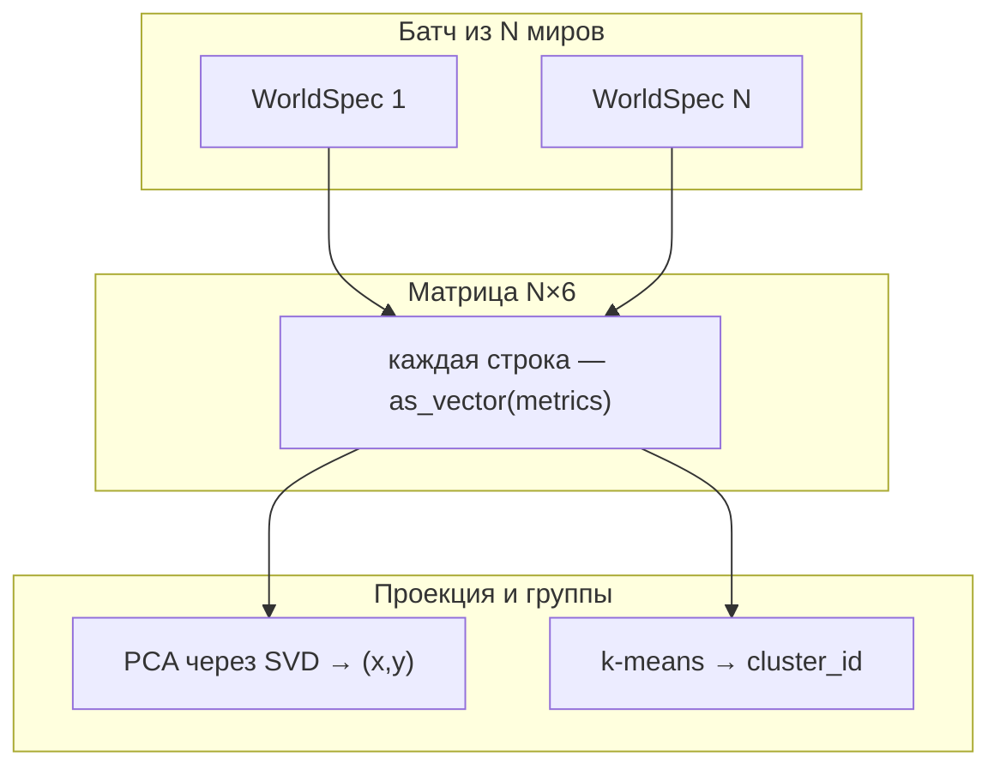
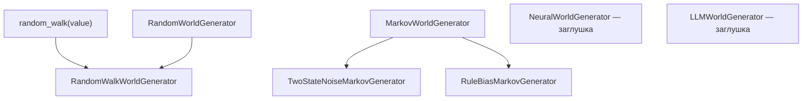

# Пакет `src.worldspace`: подробное описание

Этот документ описывает, что делает пакет **`worldspace`**, как связаны его части и что именно означают параметры вроде **`noise`** в текущей реализации. Описание привязано к коду в `src/worldspace/`.

---

## 1. Роль пакета

**Цель:** трактовать «мир» как точку в пространстве правил → прогнать простую симуляцию → получить числовой «отпечаток поведения» → спроецировать миры на плоскость и сгруппировать их.

На высоком уровне это конвейер:



- **`WorldSpec`** — статическое описание одного мира (правила и числовые параметры).
- **`run_world`** — динамика: как меняется поле во времени при данных правилах.
- **`compute_metrics`** — свёртка траектории в фиксированный вектор из шести чисел.
- **`explore_world_space`** — массовый прогон + PCA + кластеризация.

Пакет **не зависит** от legacy-слоёв приложения (`celery`, `redis`, веб-сокеты и т.д.) и задуман как автономный исследовательский пайплайн.

---

## 2. Структура модулей



| Модуль | Назначение |
|--------|------------|
| `spec.py` | Датакласс мира + сериализация JSON |
| `generators.py` | Случайные миры, random walk, цепи Маркова, заглушки NN/LLM |
| `math.py` | Численные вспомогательные функции: `neighbor_count`, `pca_2d`, `kmeans`, `binary_entropy`, `oscillation`, `pattern_diversity` (импортируется как `from . import math as ws_math`, чтобы не путать со стандартным модулем `math`) |
| `simulator.py` | Один шаг CA за итерацию времени, сбор траектории |
| `metrics.py` | Шестимерный вектор поведения |
| `pipeline.py` | Оркестрация, вызов `math` для PCA/k-means, экспорт JSONL |
| `cli.py` / `__main__.py` | Запуск из командной строки |

Краткая архитектурная заметка также есть в `src/worldspace/ARCHITECTURE.md`; этот файл (**`docs/WORLDSPACE.md`**) глубже раскрывает семантику параметров и метрик.

---

## 3. Схема данных: `WorldSpec`

Один мир — это объект **`WorldSpec`**, который можно представить как JSON.

### 3.1 Поля и смысл в коде



| Поле | Тип | Роль в симуляторе |
|------|-----|-------------------|
| `birth` | `list[int]` | Число живых соседей (Moore), при котором **мертвая** клетка становится живой |
| `survival` | `list[int]` | Число живых соседей, при котором **живая** клетка остаётся живой |
| `noise` | `float` | Вероятность **случайного переворота** состояния клетки после правила рождения/выживания (см. §4.3) |
| `resource_regen` | `float` | Вероятность появления «еды» на клетке за шаг + стартовая плотность еды |
| `predation` | `float` | Интенсивность вероятностной гибели при высокой плотности соседей |
| `cell_types` | `list[str]` | **Декларативный список** типов для спеки; текущий симулятор использует только бинарное `life` и слой `food` |
| `neighborhood` | `str` | В спеки по умолчанию `"moore"`; реализовано только **Moore** с тором |
| `grid_size` | `int` | Размер поля \(N \times N\) |
| `steps` | `int` | Число итераций времени |
| `seed` | `int` | Сид для `numpy.random.Generator` |

Пример JSON-образца:

```json
{
  "birth": [3],
  "survival": [2, 3],
  "noise": 0.01,
  "resource_regen": 0.02,
  "predation": 0.3,
  "cell_types": ["empty", "life", "food"],
  "neighborhood": "moore",
  "grid_size": 50,
  "steps": 300,
  "seed": 0
}
```

---

## 4. Симулятор: что происходит на каждом шаге

Функция **`run_world(world)`** поддерживает два скрытых поля состояния на сетке:

- **`life`** — \(0\) или \(1\) (мертва / жива).
- **`food`** — \(0\) или \(1\) (нет еды / есть еда).
- **`ages`** — возраст живой клетки в шагах (для метрики средней продолжительности «жизни» при гибели).

### 4.1 Инициализация



То есть **20%** клеток случайно живы в начале (константа в коде, не из `WorldSpec`).

### 4.2 Детерминированное ядро (birth / survival)

Для каждой клетки считается **`neighbors`** — число живых соседей по **Moore** (8 клеток), границы **торические** (`np.roll`).

$$
\text{born}(x,y) = \mathbf{1}[\text{life}=0 \land \text{neighbors} \in \text{birth}]
$$

$$
\text{survive}(x,y) = \mathbf{1}[\text{life}=1 \land \text{neighbors} \in \text{survival}]
$$

$$
\text{next\_life} = \max(\text{born}, \text{survive}) \quad \text{(побитово по клеткам)}
$$

Это обобщение «игры Жизни»: множества `birth` и `survival` задают правило целиком.

### 4.3 Что такое `noise` (шум)

После вычисления `next_life` по правилам, для **каждой клетки** независимо:

- с вероятностью **`noise`** состояние **инвертируется**: \(0 \leftrightarrow 1\).

Формально: если `flip[x,y] ~ Bernoulli(noise)`, то  
`next_life[x,y] := 1 - next_life[x,y]` при `flip`.

**Интерпретация:** это не «ошибка измерения», а **стохастический CA**: случайные мутации/радиация/микрофлуктуации правил на уровне клетки. Чем выше `noise`, тем сильнее система отталкивается от чистого правила Conway-подобной динамики.

Ограничение в генераторах может быть другим; в симуляторе значение просто должно быть адекватным для вероятности (обычно \([0, 1]\)).

### 4.4 Что такое `predation` (хищничество / давление соседей)

Если `predation > 0`:

- `exposure = neighbors / 8.0` — доля занятых соседских клеток.
- для живых клеток после шума: с вероятностью  
  **`predation * exposure`** клетка становится мёртвой.

То есть чем плотнее окружение живыми соседями, тем выше шанс «гибели от давления». Это грубая модель конкуренции/хищничества без отдельного типа «хищник».

### 4.5 Что такое `resource_regen` (ресурсы / еда)

Два использования:

1. **Инициализация:** стартовая карта еды — Bernoulli(`resource_regen`) по клеткам.
2. **Каждый шаг:** для каждой клетки независимо с вероятностью **`resource_regen`** выставляется `food = 1` (еда может «вырасти» поверх уже существующей логики).

Затем:

- если **`food == 1` и клетка живая** после всех обновлений `next_life`, еда потребляется (`food := 0`), и **`ages`** на этом шаге получает **+1 бонус** к приросту возраста (`feed_bonus`).

**Интерпретация:** еда повышает «выживаемость» возраста в смысле метрик по гибели (косвенно); отдельный тип «ресурс» на поле для правил рождения **не участвует** — только через возраст и косвенно через динамику.

### 4.6 Гибель и возраст

- Если клетка была жива (`life == 1`) и стала мёртвой (`next_life == 0`), её **`ages`** попадает в список **`death_ages`**.
- Для живых: `ages := ages + 1 + feed_bonus`; для мёртвых: `ages := 0`.

### 4.7 Сбор результатов каждого шага

На каждом шаге сохраняются:

- **`density_series`** — средняя доля живых клеток \(\mathrm{mean}(\text{life})\).
- **`alive_series`** — число живых клеток.
- **`history`** — копия поля `life` (для метрик паттернов).



---

## 5. Метрики: вектор \(M(\text{world}) \in \mathbb{R}^6\)

Функция **`compute_metrics(result)`** строит **`WorldMetrics`**. Все шесть значений берутся из **реальной траектории** симуляции.

| Имя | Как считается в коде | Пояснение |
|-----|----------------------|-----------|
| **`entropy`** | Бинарная энтропия Шеннона для **`density_mean`**: \(H(p)\) при \(p = \overline{\rho_t}\) | Не энтропия поля по паттернам, а энтропия «средней занятости во времени» как случайной бернуллиевской доли |
| **`stability`** | \(\mathrm{clip}(1 - \sigma(\rho)/(\mu(\rho)+\varepsilon), 0, 1)\) | Низкая дисперсия плотности во времени → выше стабильность |
| **`average_lifespan`** | Среднее по **`death_ages`** (пустой список → `0`) | Среднее число шагов до гибели для тех клеток, что умерли |
| **`density_mean`** | \(\mathrm{mean}(\text{density\_series})\) | Средняя заполненность поля живыми за прогон |
| **`oscillation_score`** | Максимум по лагам нормированной автокорреляции ряда плотности | Насколько ряд \(\rho_t\) похож на колеблющийся (периодика без явного FFT) |
| **`diversity`** | Доля уникальных подписей среди **`sample_size`** случайных патчей \(3\times3\) на **последнем кадре** | Грубая оценка «сколько разных локальных паттернов» |

Фиксированный порядок вектора задаётся методом **`WorldMetrics.as_vector()`**:

```text
[entropy, stability, average_lifespan, density_mean, oscillation_score, diversity]
```



---

## 6. Пространство миров: PCA и кластеры

Функция **`explore_world_space(generator, n_worlds, k_clusters)`**:

1. Генерирует **`n_worlds`** экземпляров **`WorldSpec`**.
2. Для каждого вызывает **`run_world`** → **`compute_metrics`**.
3. Строит матрицу размера **`n_worlds × 6`** из **`metrics.as_vector()`**.
4. **`math.pca_2d`** (`src/worldspace/math.py`): центрирование по столбцам, **SVD**, проекция на первые две главные компоненты → **`embedding_2d`** (координаты на плоскости для визуализации или экспорта).
5. **`math.kmeans`**: простой **k-means** по полному 6D-вектору → **`cluster_id`**.

Итоговая запись **`SpacePoint`** содержит исходный мир, метрики, 2D-точку и номер кластера.



**Важно:** PCA здесь применяется **к метрикам поведения**, а не к «сырым» параметрам `WorldSpec`. Это создаёт карту «похожести поведения», которая может не совпадать с евклидовым расстоянием в пространстве правил.

---

## 7. Генераторы миров

Идея «лестницы генераторов»:



- **`RandomWorldGenerator`** — независимые случайные правила и параметры.
- **`RandomWalkWorldGenerator`** — последовательность миров: небольшие случайные изменения от стартового.
- **`TwoStateNoiseMarkovGenerator`** — скрытое состояние «спокойный / хаотичный» меняет масштаб шума.
- **`RuleBiasMarkovGenerator`** — смещение множеств `birth`/`survival`.
- **`NeuralWorldGenerator`**, **`LLMWorldGenerator`** — пока только **`NotImplementedError`** как место расширения.

---

## 8. CLI и файлы результатов

Запуск пакета как модуля использует **`src/worldspace/__main__.py`** → **`cli.main()`**.

Примеры:

```bash
python -m src.worldspace --generator random --worlds 30 --steps 200 --grid 40
```

Сохранение в файл — только **JSONL** (одна JSON-строка на запись; родительская директория создаётся автоматически):

```bash
python -m src.worldspace --output results/run.jsonl
```

В stdout всегда печатается полный **JSON-массив** записей (удобно для быстрого просмотра); каждая запись содержит `world`, `metrics`, `embedding_2d`, `cluster_id`.

---

## 9. Ограничения и честные оговорки

1. **`cell_types`** и **`neighborhood`** в основном для совместимости со спецификацией «мира как JSON»; симулятор реализует **бинарную жизнь + еду + Moore**.
2. Начальная плотность жизни **фиксирована (20%)** в коде симулятора.
3. **`entropy`** — это не информационная энтропия конфигурации сетки, а функция от **средней плотности во времени**.
4. **`diversity`** — выборочная эвристика по последнему кадру, не полный спектр паттернов.
5. **Кластеризация и PCA** упрощённые (учебный MVP); для серьёзной карты миров имеет смысл нормализация признаков, другие методы снижения размерности и выбор расстояния.

---

## 10. Зависимости

Пакет использует **`numpy`**. Установка зависимостей проекта задаётся в **`pyproject.toml`**.

---

## См. также

- `src/worldspace/ARCHITECTURE.md` — короткая архитектурная выжимка на английском.
