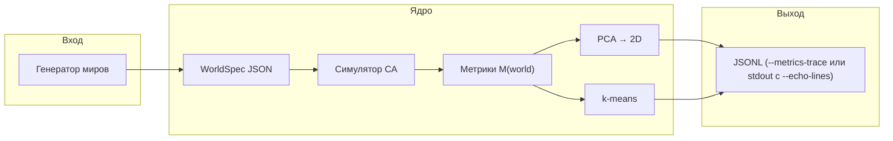
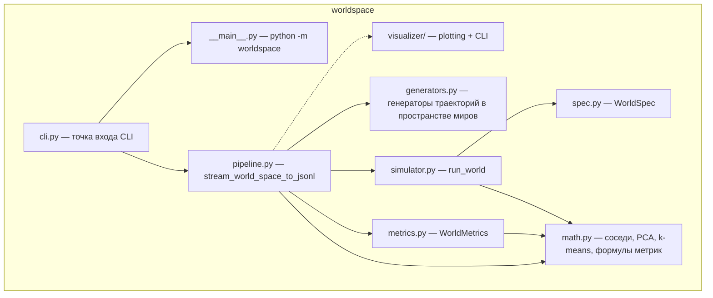
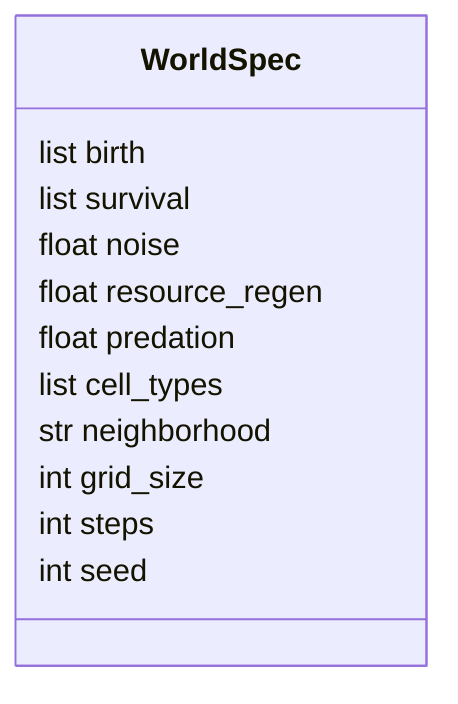
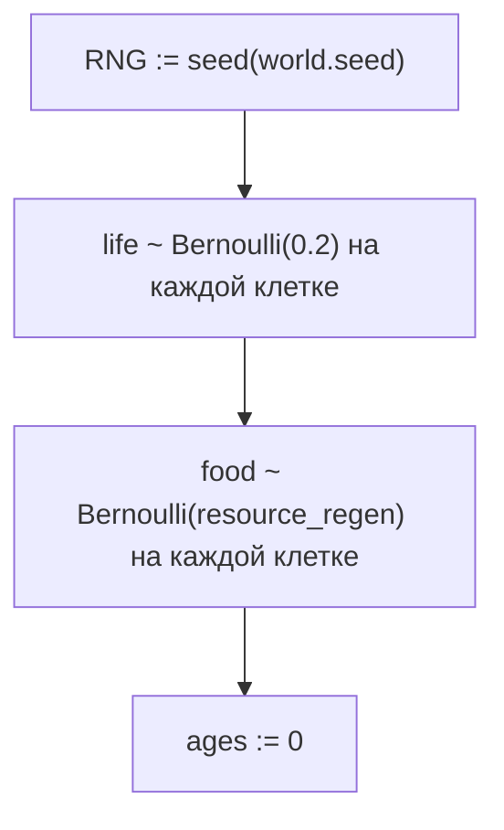
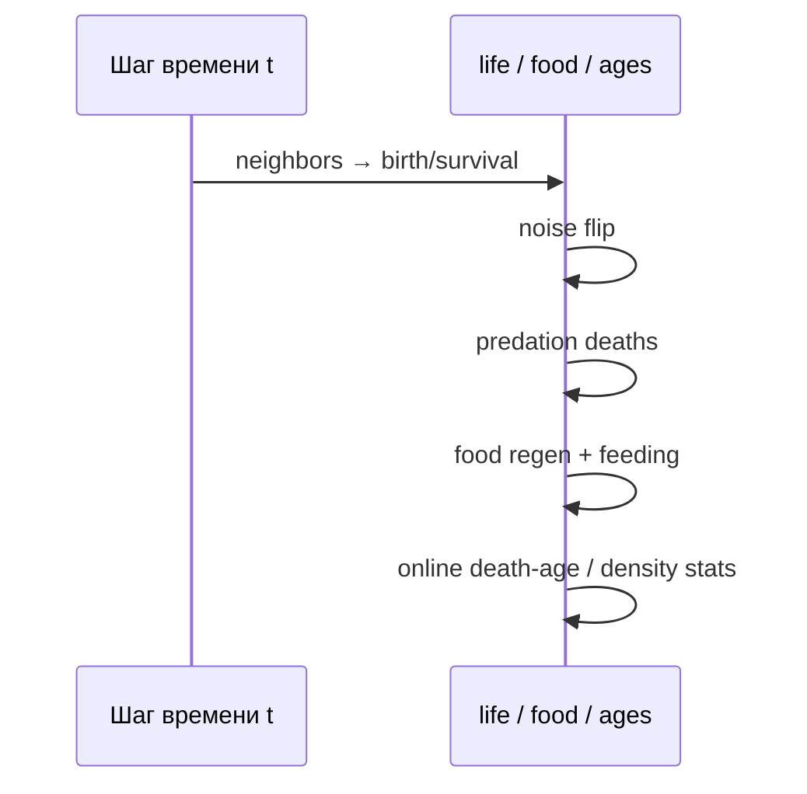
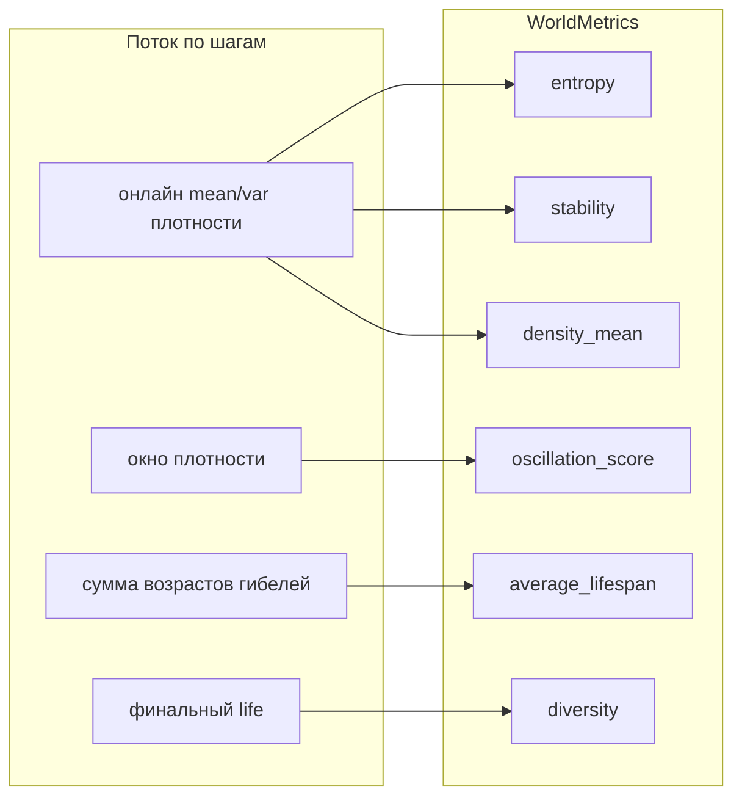
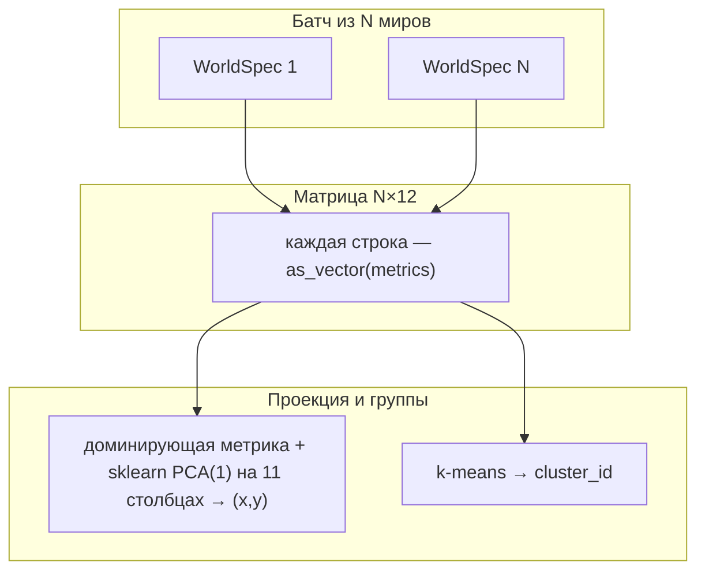
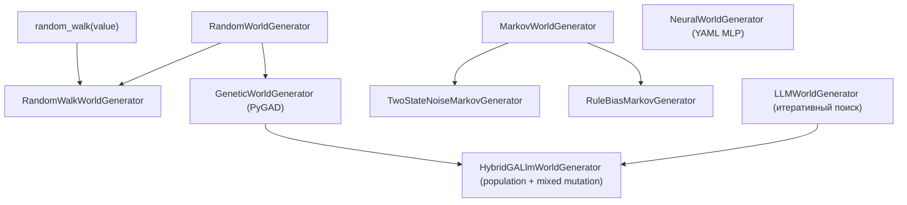

# Пакет `worldspace`: подробное описание

Этот документ описывает, что делает пакет `**worldspace**`, как связаны его части и что именно означают параметры вроде `**noise**` в текущей реализации. Описание привязано к коду в `worldspace/`.

---

## 1. Роль пакета

**Цель:** трактовать «мир» как точку в пространстве правил → прогнать простую симуляцию → получить числовой «отпечаток поведения» → спроецировать миры на плоскость и сгруппировать их.

На высоком уровне это конвейер:




- `**WorldSpec**` — статическое описание одного мира (правила и числовые параметры).
- `**run_world**` — динамика поля и **12-мерные** метрики по завершении прогона (опционально — пошаговая запись в JSONL при вызове из пайплайна с `**ca_step_trace_*`**).
- `**stream_world_space_to_jsonl**` — двухпроходный прогон: PCA/k-means по memmap, запись JSONL; список `**WorldSpec**` по одному на мир держится в RAM для второго прохода (малые JSON-структуры; зато `**iter_worlds**` не вызывается дважды — важно для LLM без дублирования HTTP). Матрица метрик по-прежнему в **memmap** O(1) по числу миров для ``n \\times`` **METRICS_VECTOR_DIM** (см. ``metrics.py``).

Пакет **не зависит** от legacy-слоёв приложения (`celery`, `redis`, веб-сокеты и т.д.) и задуман как автономный исследовательский пайплайн.

---

## 2. Структура модулей




| Модуль                                         | Назначение                                                                                                                                            |
| ---------------------------------------------- | ----------------------------------------------------------------------------------------------------------------------------------------------------- |
| `spec.py`                                      | Датакласс мира + сериализация JSON                                                                                                                    |
| `generators.py`                                | Случайные/марковские/генетические/LLM/гибридные генераторы миров + YAML-конфиги                                                                       |
| `math.py`                                      | `neighbor_count`, `kmeans_lloyd_on_memmap`, `binary_entropy`, `oscillation`, `pattern_diversity_from_frame` (импорт: `from . import math as ws_math`) |
| `simulator.py`                                 | CA по шагам; онлайн-метрики; опционально пошаговый JSONL при вызове из пайплайна (`**ca_step_trace_***`)                                              |
| `metrics.py`                                   | Датакласс метрик и сериализация вектора в JSON                                                                                                        |
| `pipeline.py`                                  | Memmap метрик, sklearn PCA, k-means; опционально `**metrics_trace_path**` (полные строки после эмбеддинга), `**ca_step_trace_path**`                  |
| `visualizer/plotting.py`                       | Matplotlib: PCA/UMAP scatter по метрикам, сетка; pandas — CA-trace, сводки, time-series и PCA/UMAP-траектории                                       |
| `visualizer/` (`__main__.py`, `visualizer.py`) | `**python -m worldspace.visualizer**` — `**--metrics-jsonl**` / `**--ca-step-jsonl**`, фиксированные имена PNG в `**--output-dir**`                  |
| `cli.py` / `__main__.py`                       | Запуск из командной строки                                                                                                                            |


Краткая архитектурная заметка также есть в `worldspace/ARCHITECTURE.md`; этот файл (`**docs/WORLDSPACE.md**`) глубже раскрывает семантику параметров и метрик.

---

## 3. Схема данных: `WorldSpec`

Один мир — это объект `**WorldSpec**`, который можно представить как JSON.

### 3.1 Поля и смысл в коде




| Поле             | Тип         | Роль в симуляторе                                                                                           |
| ---------------- | ----------- | ----------------------------------------------------------------------------------------------------------- |
| `birth`          | `list[int]` | Число живых соседей (Moore), при котором **мертвая** клетка становится живой                                |
| `survival`       | `list[int]` | Число живых соседей, при котором **живая** клетка остаётся живой                                            |
| `noise`          | `float`     | Вероятность **случайного переворота** состояния клетки после правила рождения/выживания (см. §4.3)          |
| `resource_regen` | `float`     | Вероятность появления «еды» на клетке за шаг + стартовая плотность еды                                      |
| `predation`      | `float`     | Интенсивность вероятностной гибели при высокой плотности соседей                                            |
| `cell_types`     | `list[str]` | **Декларативный список** типов для спеки; текущий симулятор использует только бинарное `life` и слой `food` |
| `neighborhood`   | `str`       | В спеки по умолчанию `"moore"`; реализовано только **Moore** с тором                                        |
| `grid_size`      | `int`       | Размер поля N \times N                                                                                      |
| `steps`          | `int`       | Число итераций времени                                                                                      |
| `seed`           | `int`       | Сид для `numpy.random.Generator`                                                                            |


Пример JSON-образца:

```json
{
  "birth": [3],
  "survival": [2, 3],
  "noise": 0.01,
  "resource_regen": 0.02,
  "predation": 0.3,
  "cell_types": ["empty", "life", "food"],
  "neighborhood": "moore",
  "grid_size": 50,
  "steps": 300,
  "seed": 0
}
```

---

## 4. Симулятор: что происходит на каждом шаге

Функция `**run_world(world)**` поддерживает два скрытых поля состояния на сетке:

- `**life**` — 0 или 1 (мертва / жива).
- `**food**` — 0 или 1 (нет еды / есть еда).
- `**ages**` — возраст живой клетки в шагах (для метрики средней продолжительности «жизни» при гибели).

### 4.1 Инициализация




То есть **20%** клеток случайно живы в начале (константа в коде, не из `WorldSpec`).

### 4.2 Детерминированное ядро (birth / survival)

Для каждой клетки считается `**neighbors`** — число живых соседей по **Moore** (8 клеток), границы **торические** (`np.roll`).

$$
\text{born}(x,y) = \mathbf{1}[\text{life}=0 \land \text{neighbors} \in \text{birth}]
$$

$$
\text{survive}(x,y) = \mathbf{1}[\text{life}=1 \land \text{neighbors} \in \text{survival}]
$$

$$
\text{nextlife} = \max(\text{born}, \text{survive}) \quad \text{(побитово по клеткам)}
$$

Это обобщение «игры Жизни»: множества `birth` и `survival` задают правило целиком.

### 4.3 Что такое `noise` (шум)

После вычисления `next_life` по правилам, для **каждой клетки** независимо:

- с вероятностью `**noise`** состояние **инвертируется**: 0 \leftrightarrow 1.

Формально: если `flip[x,y] ~ Bernoulli(noise)`, то  
`next_life[x,y] := 1 - next_life[x,y]` при `flip`.

**Интерпретация:** это не «ошибка измерения», а **стохастический CA**: случайные мутации/радиация/микрофлуктуации правил на уровне клетки. Чем выше `noise`, тем сильнее система отталкивается от чистого правила Conway-подобной динамики.

Ограничение в генераторах может быть другим; в симуляторе значение просто должно быть адекватным для вероятности (обычно [0, 1]).

### 4.4 Что такое `predation` (хищничество / давление соседей)

Если `predation > 0`:

- `exposure = neighbors / 8.0` — доля занятых соседских клеток.
- для живых клеток после шума: с вероятностью  
`**predation * exposure`** клетка становится мёртвой.

То есть чем плотнее окружение живыми соседями, тем выше шанс «гибели от давления». Это грубая модель конкуренции/хищничества без отдельного типа «хищник».

### 4.5 Что такое `resource_regen` (ресурсы / еда)

Два использования:

1. **Инициализация:** стартовая карта еды — Bernoulli(`resource_regen`) по клеткам.
2. **Каждый шаг:** для каждой клетки независимо с вероятностью `**resource_regen`** выставляется `food = 1` (еда может «вырасти» поверх уже существующей логики).

Затем:

- если `**food == 1` и клетка живая** после всех обновлений `next_life`, еда потребляется (`food := 0`), и `**ages`** на этом шаге получает **+1 бонус** к приросту возраста (`feed_bonus`).

**Интерпретация:** еда повышает «выживаемость» возраста в смысле метрик по гибели (косвенно); отдельный тип «ресурс» на поле для правил рождения **не участвует** — только через возраст и косвенно через динамику.

### 4.6 Гибель и возраст

- Если клетка была жива (`life == 1`) и стала мёртвой (`next_life == 0`), возрасты гибелей **суммируются** в счётчиках (без списка всех `death_ages`).
- Для живых: `ages := ages + 1 + feed_bonus`; для мёртвых: `ages := 0`.

### 4.7 Сбор статистики без длинных списков

Вместо списков на все шаги используется:

- **онлайн-среднее и дисперсия** плотности (Welford) → `density_mean`, `stability`;
- **сумма и число** возрастов при гибели → `average_lifespan`;
- **deque фиксированной длины** (512 последних значений плотности) → `oscillation_score` (оценка автокорреляции по окну, а не по всей длине ряда);
- **одна копия** финального поля `life` → `diversity` через `pattern_diversity_from_frame`.




---

## 5. Метрики: вектор M(\text{world}) \in \mathbb{R}^{12}

Метрики `**WorldMetrics**` вычисляются **внутри `run_world`** по онлайн-накопителям (см. §4.7). Отдельной функции `compute_metrics` нет.


| Имя                     | Как считается в коде                                                                                    | Пояснение                                                                                                  |
| ----------------------- | ------------------------------------------------------------------------------------------------------- | ---------------------------------------------------------------------------------------------------------- |
| `**entropy**`           | Бинарная энтропия Шеннона для `**density_mean**`: H(p) при p = \overline{\rho_t}                        | Не энтропия поля по паттернам, а энтропия «средней занятости во времени» как случайной бернуллиевской доли |
| `**stability**`         | \mathrm{clip}(1 - \sigma(\rho)/(\mu(\rho)+\varepsilon), 0, 1)                                           | Низкая дисперсия плотности во времени → выше стабильность                                                  |
| `**average_lifespan**`  | `death_age_sum / death_count` (нет гибелей → `0`)                                                       | Среднее число шагов до гибели по умершим клеткам                                                           |
| `**density_mean**`      | Онлайн-среднее плотности по шагам                                                                       | Средняя заполненность поля живыми за прогон                                                                |
| `**oscillation_score**` | Автокорреляция по **окну** из последних 512 значений плотности                                          | Приближение к «есть ли циклы» без хранения всего ряда                                                      |
| `**diversity`**         | Доля уникальных подписей среди `**sample_size**` случайных патчей 3\times3 на **финальном** поле `life` | Грубая оценка «сколько разных локальных паттернов»                                                         |
| `**mo_eoc_indicator`** | §5.1, `multi_objective_edge_of_chaos_indicator` в `**metrics.py**` | Скаляр **Multi-Objective + Edge-of-Chaos** для GA/LLM/Hybrid (коэффициенты в §5.1). |
| `**topology_interface_index**` | `worldspace.math.topology_interface_index(life)` | Доля отличающихся соседей по тору (Moore, 8 направлений), усреднённая по клеткам и делённая на 8; в ``[0,1]`` — **топологическая / морфологическая сложность границ** живой фазы. |
| `**topology_window_heterogeneity**` | `topology_window_heterogeneity(life)` | Доля торических окон ``2\\times2``, где четыре угла **не все одинаковы**; в ``[0,1]`` — мезомасштабная **нетривиальность** паттерна (прокси к локальной «седловости» / смешению без полного persistent homology). |
| `**compressibility_score**` | `compressibility_score_joint(life, food)` | ``1 - len(zlib.compress(raw))/len(raw)`` по конкатенации байтов ``life`` и ``food`` (zlib level 6), в ``[0,1]`` — **приближённая вычислимость / описательная длина**: упорядоченные поля сжимаются сильнее. |
| `**ecology_state_entropy_norm**` | `ecology_state_entropy_norm(life, food)` | Энтропия Шеннона по классам ``code = life + 2*food`` (до 4 классов), нормированная на ``\\log_2 k`` для числа **ненулевых** классов; в ``[0,1]`` — **экологическое разнообразие** совместного состояния «жизнь + ресурс». |
| `**ecology_resource_adjacency**` | `ecology_resource_adjacency(life, food)` | Среднее по живым клеткам доли соседей с ``food==1`` (Moore, тор); в ``[0,1]`` — **пространственная связность** потребителей и ресурса. |


Фиксированный порядок вектора задаётся методом `**WorldMetrics.as_vector()**`:

```text
[entropy, stability, average_lifespan, density_mean, oscillation_score, diversity, mo_eoc_indicator, topology_interface_index, topology_window_heterogeneity, compressibility_score, ecology_state_entropy_norm, ecology_resource_adjacency]
```




### 5.1. Скаляр `mo_eoc_indicator` (Multi-Objective + Edge-of-Chaos)

Итоговое число пишется в JSON как поле `metrics.mo_eoc_indicator` и считается в `worldspace.metrics.multi_objective_edge_of_chaos_indicator` после прогона `run_world`. Ниже те же обозначения, что в коде.

**Входы (уже посчитанные скаляры мира):**

| Символ | Поле | Диапазон / смысл |
|--------|------|------------------|
| \(H\) | `entropy` | \([0,1]\) — бинарная энтропия Шеннона по средней плотности |
| \(S\) | `stability` | \([0,1]\) |
| \(D\) | `diversity` | \([0,1]\) — доля уникальных патчей |
| \(A\) | `oscillation_score` | \(\ge 0\), на практике обычно \(\le 1\) (нормированная автокорреляция) |
| \(E_{\mathrm{ext}}\) | `extinction_penalty` | \(\mathrm{clip}(1 - \rho_{\mathrm{final}},\,0,\,1)\), где \(\rho_{\mathrm{final}}\) — средняя заполненность **финального** поля |

**Производные величины:**

1. **Кривизна по энтропии (вместо сырого \(H\) в «полосе» края хаоса):**  
   \[
   C_H = H(1-H).
   \]  
   На \([0,1]\) величина \(C_H\) максимальна при \(H=\tfrac12\) (\(C_H^{\max}=\tfrac14\)): это «критическая» зона между пустым и переполненным полем, а не экстремумы \(H\approx 0\) или \(H\approx 1\).

2. **Нормировка \(C_H\) к \([0,1]\)** (удобно для весов в коде):  
   \[
   \widehat C_H = \frac{C_H}{0.25} = 4\,H(1-H).
   \]  
   Таким образом в формуле **используется именно \(C_H=H(1-H)\)**; множитель \(1/0.25\) только приводит вклад к единой шкале \([0,1]\).

3. **Активность × устойчивость (вторая интерпретация «края хаоса» — динамика при ненулевой памяти по жизни):**  
   \[
   P = \mathrm{clip}\!\left(\frac{\text{average\_lifespan}}{10},\,0,\,1\right),
   \qquad
   C_{AP} = A\cdot P.
   \]  
   \(A\) — «есть ли колебания плотности», \(P\) — нормированное среднее время жизни погибших клеток (прокси **persistence**). Их произведение усиливает миры, где и динамика, и устойчивое развитие по шагам согласованы.

**База multi-objective:**

\[
\mathrm{MO} = H + S + D.
\]

**Итоговая формула (как в коде, один-в-один):**

\[
\boxed{
\mathrm{mo\_eoc}
=
\mathrm{MO}\cdot\bigl(0{,}50 + 0{,}30\,\widehat C_H + 0{,}20\,C_{AP}\bigr)
+ 0{,}15\,A\,\widehat C_H
+ 0{,}10\,P
- E_{\mathrm{ext}}
}
\]

**Смысл коэффициентов:**

- **\(0{,}50\)** — постоянная доля: даже при низкой «кривизне» и без \(C_{AP}\) скаляр опирается на сумму \(H+S+D\).
- **\(0{,}30\,\widehat C_H\)** внутри скобки — усиливает \(\mathrm{MO}\), когда система в энтропийной середине (\(\widehat C_H\to 1\)); на застывших или тривиальных режимах (\(\widehat C_H\to 0\)) этот множитель к \(\mathrm{MO}\) падает.
- **\(0{,}20\,C_{AP}\)** — добавка к множителю при «осцилляциях + выживаемости».
- **\(+0{,}15\,A\,\widehat C_H\)** — прямой бонус динамике, но **сильнее**, когда одновременно высока нормированная кривизна \(C_H\) (согласованность с картиной «края хаоса» по энтропии).
- **\(+0{,}10\,P\)** — небольшой сдвиг в пользу более длинной средней жизни (в пределах клипа).
- **\(-E_{\mathrm{ext}}\)** — штраф за вымирание / почти пустое финальное поле (как и раньше в проекте).

Сумма весов внутри скобки при «идеальных» \(\widehat C_H=1\), \(C_{AP}=1\) даёт \(1{,}00\); при нулях — \(0{,}50\). Это намеренно **не** выпуклая нормализация на \([0,1]\): скаляр остаётся неограниченным сверху за счёт \(\mathrm{MO}\) и дополнительных слагаемых, что удобно для **ранжирования** миров в GA/сортировке популяции.

### 5.2. Топология, сжатие и экология (последние пять координат)

Пять дополнительных скаляров считаются **по финальным** сеткам `life` и `food` внутри `_metrics_from_final_state` (см. `worldspace/simulator.py`, функции в `worldspace/math.py`). Они расширяют «поведенческий» вектор мира без участия в формуле `mo_eoc_indicator` §5.1.

- **Топология (приближённые, быстрые):** `topology_interface_index` — нормированная плотность границ живой/мёртвой фазы на торе; `topology_window_heterogeneity` — доля локально неоднородных окон `2×2`. Это **не** Betti-числа и не persistent homology: дешёвые прокси морфологической сложности.
- **Сжатие:** `compressibility_score` — отношение длины zlib-сжатия к длине сырых байтов `life‖food`; отражает **алгоритмическую простоту** конфигурации (высокий балл ≈ «короткое описание»).
- **Экология двух типов на клетку** (`life` ∈ {0,1}, `food` ∈ {0,1}, как в симуляторе): `ecology_state_entropy_norm` — энтропия совместного 4-типного распределения; `ecology_resource_adjacency` — насколько рядом с живыми клетками лежит еда. Список `WorldSpec.cell_types` задаёт **имена** типов в спеке; в текущем MVP динамика остаётся бинарной по жизни + отдельной сетке ресурса.

---

## 6. Пространство миров: PCA и кластеры

Функция `**stream_world_space_to_jsonl(..., metrics_trace_path=..., ca_step_trace_path=...)**` (`worldspace/pipeline.py`):

1. **Проход 1:** для каждого мира из `**generator.iter_worlds(n)`** — `**run_world**` (вектор метрик **после полного прогона** пишется в **memmap** `(n × 12)`). Список `**WorldSpec`** для всех `n` миров сохраняется для прохода 2 (без повторного `**iter_worlds**`, что убирает второй круг HTTP у `**LLMWorldGenerator**`). Если задан `**ca_step_trace_path**`, в `**run_world**` передаётся файловый дескриптор: на **каждый шаг CA** дописывается JSON-строка с `**yield_index`**, `**ca_step**`, `**metrics**` (только вызовы из этого прохода пайплайна).
2. По матрице метрик батча: `**_fit_dominant_metric_orthogonal_pca**` — ось **x** как отклонение метрики с **максимальной дисперсией** по батчу от её среднего; ось **y** — **первый главный компонент sklearn `PCA(n_components=1)`**, обученный на **остальных 11** столбцах (sklearn центрирует эти признаки внутри `fit`).
3. **k-means Lloyd** по строкам memmap (центроиды `**k×12`**, метки в отдельном memmap).
4. **Проход 2:** для индекса `**i`** берётся `**worlds[i]**` и строка memmap; раскладка в 2D (`**dominant_metric_delta_xy**`), `**cluster_id**`, запись **одной JSON-строки** в основной файл (если задан `**path`**) и при `**echo_stdout=True**` — в stdout. Если задан `**metrics_trace_path**`, после прохода 2 в этот файл пишется по строке на мир: `**yield_index**` плюс те же поля, что и в основной записи (`world`, `metrics`, `dominant_metric_delta_xy`, `dominant_metric_delta_axis_labels`, `cluster_id`) — вход для `**python -m worldspace.visualizer --metrics-jsonl**`.

Основной JSONL (если задан аргумент `**path**` в `**stream_world_space_to_jsonl**`) и строки в `**--metrics-trace**` после прохода 2 содержат поля `world`, `metrics`, `dominant_metric_delta_xy`, `dominant_metric_delta_axis_labels`, `cluster_id`; в `**--metrics-trace**` дополнительно есть `**yield_index**`. Временный memmap метрик удаляется после завершения функции. При `**n_worlds ≤ 0**` trace-файлы **не открываются**.

### 6.1. Поля `dominant_metric_delta_xy` и `dominant_metric_delta_axis_labels`

Это **не** нейросетевый embedding и **не** то же самое, что `**pca.png**` / `**umap.png**` (там снижение размерности по **всем 12** финальным метрикам).

| Поле | Смысл |
|------|--------|
| `**dominant_metric_delta_xy**` | `[x, y]` — координаты мира: Δ доминирующей метрики и PC1 **остальных 11** |
| `**dominant_metric_delta_axis_labels**` | Подписи осей: какая метрика на **x**, текст для **y** |

**Ось x:** метрика с **наибольшей дисперсией в текущем батче** минус её среднее по батчу: «насколько мир отклоняется по самой «размазанной» метрике».

**Ось y:** **PC1 sklearn** по **остальным 11** метрикам (доминирующая на x **не входит** в PCA). Центрирование только внутри `PCA` по этим столбцам (`pca.mean_` — их средние). При `**n < 2**` миров **y = 0** у всех.

**Цвет точек** на графиках: `**cluster_id**` (k-means Lloyd по полному 12D-вектору метрик в пайплайне) или пересчёт k-means в visualizer (`**--k-clusters**`).

Старые trace: visualizer читает алиасы `embedding_2d` / `embedding_axes`, `world_space_xy` / `world_space_axis_labels`. Пайплайн пишет только `dominant_metric_delta_*`.

**Три scatter из `--metrics-jsonl`:**

| PNG | Геометрия |
|-----|-----------|
| `**dominant_metric_delta.png**` | Δ доминирующей метрики vs PC1 остальных 11 (как в trace) |
| `**pca.png**` | 2D PCA по всем 12 метрикам |
| `**umap.png**` | 2D UMAP по всем 12 метрикам (≥3 мира) |




**Важно:** PCA здесь применяется **к метрикам поведения**, а не к «сырым» параметрам `WorldSpec`. Это создаёт карту «похожести поведения», которая может не совпадать с евклидовым расстоянием в пространстве правил.

---

## 7. Генераторы миров

Идея «лестницы генераторов»:




- `**RandomWorldGenerator**` — независимые случайные правила и параметры.
- `**RandomWalkWorldGenerator**` — последовательность миров: небольшие случайные изменения от стартового.
- `**TwoStateNoiseMarkovGenerator**` — скрытое состояние «спокойный / хаотичный» меняет масштаб шума.
- `**RuleBiasMarkovGenerator**` — смещение множеств `birth`/`survival`.
- `**GeneticWorldGenerator**` — эволюция миров через PyGAD по фитнесу `mo_eoc_indicator` (хромосома = правила + скаляры).
- `**LLMWorldGenerator**` — цикл `simulate -> score -> LLM patch -> validate/clamp -> next`.
- `**HybridGALlmWorldGenerator**` — популяционная схема: отбор (top-k + random diversity), затем `random mutation` + `LLM-guided mutation`; LLM видит верхнюю долю лучших миров.
- `**NeuralWorldGenerator**` — генерация через латентный MLP с YAML-спекой.

### vi7.1 YAML-конфиги генераторов

- `worldspace/specs/genetic_world_generator.yaml`
- `worldspace/specs/llm_world_generator.yaml`
- `worldspace/specs/hybrid_world_generator.yaml`
- `worldspace/specs/neural_world_generator.yaml`

CLI поддерживает переопределение пути к YAML через единый флаг `--generator-spec` (вместе с `--generator genetic|llm|hybrid|neural`); форма файла проверяется и должна соответствовать выбранному генератору.

---

## 8. CLI и файлы результатов

Запуск пакета как модуля использует `**worldspace/__main__.py**` → `**cli.main()**`.

Примеры:

```bash
python -m worldspace --generator random --worlds 30 --steps 200 --grid 40
```

Другие режимы генератора:

```bash
python -m worldspace --generator genetic --generator-spec worldspace/specs/genetic_world_generator.yaml
python -m worldspace --generator llm --generator-spec worldspace/specs/llm_world_generator.yaml
python -m worldspace --generator hybrid --generator-spec worldspace/specs/hybrid_world_generator.yaml
python -m worldspace --generator neural --generator-spec worldspace/specs/neural_world_generator.yaml
```

Запись **JSONL** из CLI: основной поток — `**--metrics-trace PATH`** (одна JSON-строка на мир после dominant-metric-delta + k-means: `yield_index`, `world`, `metrics`, `dominant_metric_delta_xy`, `dominant_metric_delta_axis_labels`, `cluster_id`) и/или `**--ca-step-trace PATH**`. Дополнительно (любой `**--generator**`):

- `**--echo-lines**` — печатать в stdout те же полные записи по миру (без `yield_index`), что и в строках основного конвейера при записи в файл через API `**path**`; без этого флага и без `**--metrics-trace**` / `**--ca-step-trace**` stdout остаётся пустым.
- `**--ca-step-trace PATH**` — JSONL: на каждый **шаг CA** внутри `**run_world`** для каждого такого мира — `yield_index`, `ca_step`, `metrics`. Внутренние вызовы `**run_world**` из генераторов (например, оценка родителя в `**LLMWorldGenerator**`) **не** пишутся в этот файл.

```bash
python -m worldspace --metrics-trace results/trace.jsonl --ca-step-trace results/ca_steps.jsonl
```

Чтобы дублировать полные записи по миру в stdout (без записи в файл), задайте `**--echo-lines**`.

**Визуализация** (единая точка входа, pandas + matplotlib):

```bash
uv run python -m worldspace.visualizer \
  --output-dir results/plots \
  --metrics-jsonl results/trace.jsonl \
  --ca-step-jsonl results/ca_steps.jsonl \
  --ca-trace-worlds 0,10,20 \
  --summary
```

Из `**--metrics-jsonl**`: `**dominant_metric_delta.png**`, `**pca.png**`, `**umap.png**` (см. §6.1; цвет k-means). Из `**--ca-step-jsonl**`: `**ca_step_timeseries.png**`, `**pca_trajectories.png**`, `**umap_trajectories.png**`; `**--summary**` печатает сводку **mean/std/min/max** по метрикам в разрезе `**yield_index**`.

`**plot_simulation_final_grid**` (API в `**worldspace.visualizer.plotting**`) использует `**result.final_life**`.

---

## 9. Ограничения и честные оговорки

1. `**cell_types**` и `**neighborhood**` в основном для совместимости со спецификацией «мира как JSON»; симулятор реализует **бинарную жизнь + еду + Moore**.
2. Начальная плотность жизни **фиксирована (20%)** в коде симулятора.
3. `**entropy`** — это не информационная энтропия конфигурации сетки, а функция от **средней плотности во времени**.
4. `**diversity`** — выборочная эвристика по последнему кадру, не полный спектр паттернов.
5. **Кластеризация и PCA** упрощённые (учебный MVP); для серьёзной карты миров имеет смысл нормализация признаков, другие методы снижения размерности и выбор расстояния.

---

## 10. Зависимости

Пакет использует `**numpy`**, `**matplotlib**`, `**scikit-learn**`, `**pandas**`, `**pyyaml**`, `**pygad**`, `**torch**` (см. `**pyproject.toml**`). Установка: `**uv sync**` в корне репозитория.

---

## См. также

- `worldspace/ARCHITECTURE.md` — короткая архитектурная выжимка на английском.

