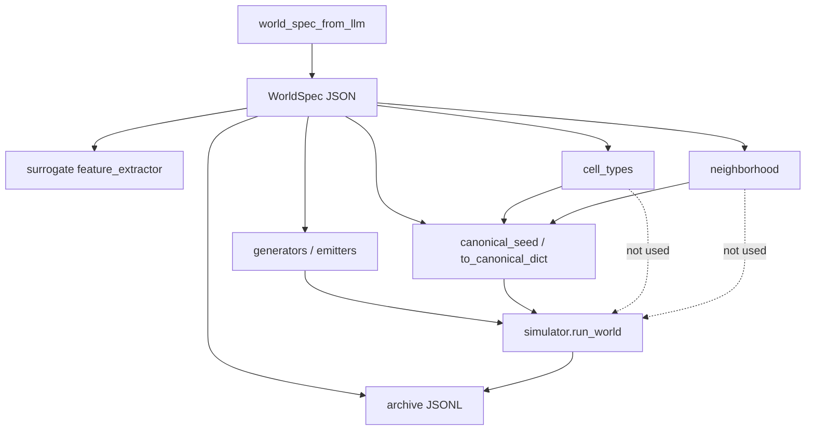

# WorldSpec audit: parameters and usage map

> **Purpose:** inventory of every `WorldSpec` field and related runtime knobs — where they are read, mutated, bounded, and serialized.  
> **Companion:** behavioral simulator details remain in [`WORLDSPACE.md`](WORLDSPACE.md).  
> **Source of truth:** `worldspace/specs/spec.py` (`WorldSpec` dataclass).

Last reviewed against the codebase: 2026-05-21.

---

## 1. Summary

`WorldSpec` is the JSON-serializable description of one cellular-automata world. Only **seven fields** drive `run_world` today: `birth`, `survival`, `noise`, `resource_regen`, `predation`, `grid_size`, `steps`, and `seed` (RNG). The fields `cell_types` and `neighborhood` are **schema/metadata** for archives and LLM JSON; they do not change simulator topology or cell encoding.

Several **constants are not in `WorldSpec`** but are hard-coded in the simulator (initial life density, Moore neighborhood, torus wrap).

---

## 2. `WorldSpec` fields (complete table)

| Field | Type | Default | Valid range / constraints | Simulator (`run_world`) | Canonical hash (`to_canonical_dict`) | Typical mutation |
| ----- | ---- | ------- | ------------------------- | ------------------------ | ------------------------------------- | ---------------- |
| `birth` | `list[int]` | — (required) | Unique ints in `[0, 8]`; ≥1 value; neighbor counts for dead→alive | **Yes** — `np.isin(neighbors, world.birth)` | Sorted copy | Random / genetic / LLM / neural / random-walk |
| `survival` | `list[int]` | — (required) | Same as `birth`; live→alive | **Yes** — `np.isin(neighbors, world.survival)` | Sorted copy | Same |
| `noise` | `float` | — (required) | `[0.0, 0.2]` (`world_param_bounds`) | **Yes** — per-cell flip after rules | Rounded 6 dp | Same |
| `resource_regen` | `float` | — (required) | `[0.0, 0.5]` | **Yes** — initial food Bernoulli + per-step regen | Rounded 6 dp | Same |
| `predation` | `float` | — (required) | `[0.0, 1.0]` | **Yes** — death prob ∝ `predation × neighbors/8` | Rounded 6 dp | Same |
| `cell_types` | `list[str]` | — (required) | LLM constraint: normalize to `["life", "food"]` | **No** | **Forced** to `CANONICAL_CELL_TYPES` | Overwritten by emitters / LLM parser; generators may emit `["empty","life","food"]` |
| `neighborhood` | `str` | `"moore"` | No validator; only Moore implemented | **No** — `ws_math.neighbor_count` is always Moore+torus | Stored as-is | LLM may set string; genetics hardcodes `"moore"` |
| `grid_size` | `int` | `50` | Positive int; not centrally clamped | **Yes** — grid side `N` | As-is | CLI `--grid` / illuminator `grid_size` override in loop |
| `steps` | `int` | `300` | ≥1; illuminator floor `200` | **Yes** — CA loop length | As-is | CLI `--steps` / illuminator; `max(steps, 200)` in MAP-Elites |
| `seed` | `int` | `0` | Any int; **runtime** identity | **Yes** — `np.random.default_rng(world.seed)` | **Omitted** from canonical dict; set via `apply_canonical_seed` | Cleared before eval (`strip_seed`); derived from canonical payload |

Constants:

```python
CANONICAL_CELL_TYPES = ["life", "food"]  # worldspace/specs/spec.py
```

**Notes (metadata fields only):**

- **`neighborhood`** — Reserved for a future topology switch (e.g. von Neumann = 4 neighbors, rules 0…4). Today only Moore+torus is coded; the string still affects `canonical_seed` if changed. Until a second topology ships, treat as fixed `"moore"` or force it in `to_canonical_dict()`.
- **`cell_types`** — LLM/pipeline normalize to `["life", "food"]` because the simulator has two layers (`life`, `food`); `predation` is crowding on live cells, not a predator species. Extending to herbivores/predators/etc. needs a new state model, metrics v2, genome/surrogate/archive schema — not prompt-only. **Pros:** richer ecology, meaningful JSON, trophic stories. **Cons:** large sim rewrite, breaks 12-D metrics and archives, search-space bloat, name clash with `predation`. Prefer deepening current scalars or a versioned `worldspace/v2` branch.

---

## 3. Where each field is used (by subsystem)

### 3.1 Simulator (`worldspace/simulator.py`)

| Field | Usage |
| ----- | ----- |
| `seed` | RNG for init, noise, predation, food regen |
| `grid_size` | Shape `(N, N)` for `life`, `food`, `ages` |
| `steps` | Number of CA iterations |
| `birth`, `survival` | Totalistic rules on Moore neighbor count |
| `noise` | Random bit-flip of `next_life` |
| `resource_regen` | Bernoulli rate for initial and ongoing `food` |
| `predation` | Stochastic death under crowding |
| `cell_types`, `neighborhood` | **Not referenced** |

**Not in `WorldSpec` but fixed in simulator:**

| Constant | Value | Location |
| -------- | ----- | -------- |
| Initial live density | `0.2` (20% cells alive) | `_initial_grids` |
| Neighborhood topology | Moore, 8 neighbors | `worldspace/math.py` → `neighbor_count` |
| Boundary | Toroidal (`np.roll`) | `neighbor_count` |
| Predation normalization | `neighbors / 8.0` | `_next_life_from_rules` |
| Feed bonus | Live cell on `food==1` clears food, `ages` +1 | `_tick_food` |

### 3.2 Canonical seed (`worldspace/illuminators/evaluation.py`)

Pipeline for MAP-Elites / dashboard replay / surrogate:

1. `strip_seed` — `seed=0`, `cell_types=CANONICAL_CELL_TYPES`
2. `_prepare_world_spec` (loop only) — set `grid_size`, `steps = max(steps, ILLUMINATOR_MIN_STEPS)`
3. `evaluate_candidate` — again `steps` floor if `enforce_min_steps`
4. `apply_canonical_seed` — `seed = SHA256(to_canonical_dict())[:8] mod 2³²`

`to_canonical_dict()` includes: sorted rules, rounded floats, forced `cell_types`, **`neighborhood`**, `grid_size`, `steps`.  
Changing `neighborhood` without changing rules **changes the derived seed** even though the simulator ignores it.

### 3.3 Genome encode/decode (`worldspace/illuminators/emitters/genetics.py`)

21-gene vector: 9 birth bits + 9 survival bits + `(noise, resource_regen, predation)`.

| Encoded | Not in genome |
| ------- | ------------- |
| `birth`, `survival`, `noise`, `resource_regen`, `predation` | `cell_types` → always canonical on decode |
| | `neighborhood` → always `"moore"` on decode |
| | `grid_size`, `steps` → passed into `decode_genome(...)` |
| | `seed` → `0` until canonical assignment |

### 3.4 LLM parsing (`worldspace/specs/world_spec_from_llm.py`)

Reads from JSON: `birth`, `survival`, `noise`, `resource_regen`, `predation`, optional `neighborhood`.  
**Ignores** LLM `cell_types` — always `CANONICAL_CELL_TYPES`.  
`grid_size` / `steps` come from illuminator arguments, not the model payload.

Prompt constraints (`world_spec_constraints.py`): `birth`, `survival`, `noise`, `resource_regen`, `predation`, `cell_types` (normalize only). **`neighborhood` is not listed for the model.**

Legacy patch path (`generators/__init__.py` → `_apply_world_patch`): mutates rules + three floats only; preserves other fields via `dataclasses.replace`.

### 3.5 Generators (`worldspace/generators/`)

| Generator | Sets / mutates |
| --------- | ---------------- |
| `RandomWorldGenerator` | All rule fields; `cell_types=DEFAULT_CELL_TYPES` (`["empty","life","food"]`); `neighborhood` default; `seed=i` |
| `RandomWalkWorldGenerator` | Rules + floats + `seed`; inherits `cell_types` / `neighborhood` from start world |
| `GeneticWorldGenerator` / `decode_genome` | Canonical `cell_types`, `neighborhood="moore"` |
| `NeuralWorldGenerator` | Rules + floats from MLP; `cell_types` / `neighborhood` / `grid_size` / `steps` from YAML `world_defaults`; `seed=index` until canonical |
| Markov generators | Rule/noise mutations; inherit metadata fields |
| MAP-Elites emitters | `strip_seed` after generation |

**Legacy batch vs MAP-Elites emitters** (see [`ARCHITECTURE.md`](ARCHITECTURE.md) «Two execution paths»):

| | Legacy (`--generator` → `stream_world_space_to_jsonl`) | MAP-Elites (`--illuminator mapelites`) |
| --- | --- | --- |
| Orchestration | `WorldGenerator.generate` / `iter_worlds`, then PCA + k-means | `illuminators/emitters` per archive slot |
| Primary fitness | `mo_eoc_indicator` (PyGAD / hybrid / LLM batch) | `compute_fitness` in `evaluation.py` |
| Typical output | metrics-trace JSONL, `cluster_id` | `map_elites_archive.jsonl` |

The **generators package is not deprecated wholesale**: emitters reuse `RandomWorldGenerator`, `emitters/genetics.py` (same 21-gene encoding as `GeneticWorldGenerator`, without PyGAD), and `llm_patch` / `world_spec_from_llm`. Legacy-only: full-batch GA (`GeneticWorldGenerator`), `HybridGALlmWorldGenerator`, Markov/random-walk as the main search driver, and the two-pass pipeline layout. `NeuralWorldGenerator` remains CLI-only (`--generator neural`), not wired into MAP-Elites.

### 3.6 Pipeline & CLI (`worldspace/pipeline.py`, `worldspace/cli.py`)

- `stream_world_space_to_jsonl`: runs `run_world` per generated spec; writes `world.to_json_dict()` into JSONL.
- Legacy CLI defaults: `--grid` 40, `--steps` 200 (MAP-Elites CLI enforces `steps >= 200`).
- Generator constructors take `(grid_size, steps)` separately from each `WorldSpec` — loop **overwrites** spec grid/steps for illuminator runs.

### 3.7 Archive JSONL (`worldspace/illuminators/archive.py`)

Each elite record (schema 1.2) stores the **full** `world_spec` via `to_json_dict()` (includes runtime `seed` after evaluation).  
Flattened dashboard rows copy `world_spec` dict and expose top-level `seed` for filtering.

### 3.8 Surrogate (`worldspace/surrogate/`)

`feature_extractor.extract` (v2, schema `"2.0"`) uses genome-aligned bitmasks for `birth` and `survival` (9 each), plus `noise`, `resource_regen`, `predation`. Does **not** include `grid_size`, `steps`, or `seed`. Does **not** use `cell_types` or `neighborhood`.  
Must run after `apply_canonical_seed` (same as before).  
Cache key = hash of `to_canonical_dict()` (same as surrogate identity, not raw `seed` before canonicalization).

### 3.9 Dashboard (`dashboard/`)

- Loads `world_spec` from archive JSONL; `world_spec_from_dict` → `WorldSpec`.
- `world_renderer`: `_prepare_world_spec` + `apply_canonical_seed` before `run_world` (matches illuminator).
- `canonical_world_spec_hash`: hash of `to_canonical_dict()` for dedup/cache keys.
- Filters: `seed` from flattened row; not other spec fields by default.

### 3.10 Visualizer / diagnostics

Uses evaluated `WorldSpec` for titles (`seed`, `grid_size`, `steps`); simulation already completed — no re-read of `cell_types` / `neighborhood`.

---

## 4. Related configuration (not `WorldSpec` fields)

These files influence worlds but are **not** part of the dataclass:

| File | What it controls |
| ---- | ---------------- |
| `worldspace/specs/world_param_bounds.py` | `NOISE_*`, `RESOURCE_REGEN_*`, `PREDATION_*`, rule index count 9 |
| `worldspace/specs/world_spec_constraints.py` | LLM prompt bullets |
| `worldspace/specs/neural_world_generator.yaml` | MLP architecture, decoder thresholds/scales, `world_defaults` (`grid_size`, `steps`, `cell_types`, `neighborhood`) |
| `worldspace/specs/llm_world_generator.yaml` | LLM temperature, endpoints (not CA rules) |
| `worldspace/illuminators/scheduler.py` | `grid_resolution`, `early_extinction_step`, batch emitters |
| `worldspace/illuminators/evaluation.py` | `ILLUMINATOR_MIN_STEPS = 200`, fitness weights, binning on `stability` / `diversity` |

**Illuminator-only runtime parameters:**

| Parameter | Default | Effect |
| --------- | ------- | ------ |
| `ILLUMINATOR_MIN_STEPS` | 200 | Floor on `spec.steps` before simulation |
| `early_extinction_step` | 200 (scheduler) | Stop early if `life.mean()==0` before this step |
| `grid_size` (loop arg) | from CLI/config | Replaces `WorldSpec.grid_size` in `_prepare_world_spec` |

---

## 5. Serialization and hashing

| Method | Contents | Used for |
| ------ | -------- | -------- |
| `to_json_dict()` / `save_json` / `from_json_dict` | Full dataclass `asdict` | Archives, pipeline JSONL, LLM prompts |
| `to_canonical_dict()` | Normalized rules/floats; forced `cell_types`; includes `neighborhood` | `canonical_seed`, surrogate cache, dashboard hash |

**No validation** on `from_json_dict` — missing keys raise at construct time; extra JSON keys are ignored by dataclass.

---

## 6. Implicit state (simulator grids, not in JSON)

| Grid | Type | Role |
| ---- | ---- | ---- |
| `life` | `uint8` 0/1 | CA alive/dead |
| `food` | `uint8` 0/1 | Resource layer (named by `cell_types` in docs, not driven by list) |
| `ages` | `int16` | Live-cell age for `average_lifespan` metric |

---

## 7. `WorldMetrics` (12-D output, not in `WorldSpec`)

Computed in `simulator._metrics_from_final_state` after `run_world`. Fixed order: `METRIC_KEYS` in `worldspace/metrics.py`. Used for: pipeline JSONL / PCA layout, archive `metrics`, MAP-Elites **fitness** (subset + `topology_complexity`), behavioral coordinates **`stability`** and **`diversity`** only, GA/LLM scalar **`mo_eoc_indicator`**. Details: [`WORLDSPACE.md`](WORLDSPACE.md) §5, [`FORMULAS.md`](FORMULAS.md).

| Field | Meaning | Interpretation (high ≈ …) | Why it exists |
| ----- | ------- | ------------------------- | ------------- |
| `entropy` | Binary Shannon \(H(\bar\rho)\) on **time-mean** live density \(\bar\rho\), not spatial pattern entropy | Mid \(\bar\rho\) → higher \(H\); all-dead or all-live → low | Cheap occupancy signal; MO+EoC uses curvature on this \(H\) |
| `stability` | `1 − σ(ρ)/(\mu(ρ)+ε)` from online Welford over per-step mean density | Steady density trace → high; wild swings → low | MAP-Elites **behavior** axis |
| `average_lifespan` | Mean age at death when `life` flips 1→0; 0 if no deaths | Long-lived cells → high | Ties rules + food to persistence; MO+EoC term |
| `density_mean` | Online mean of `life.mean()` each step | More live cells on average → high | Feeds `entropy`, extinction proxy |
| `oscillation_score` | Max normalized autocorrelation of last **512** density samples (`math.oscillation`) | Rhythmic density → high; monotone → low | Non-frozen dynamics; fitness weight |
| `diversity` | Share of unique random **3×3** `life` patches on **final** frame | Many local motifs → high; uniform field → low | MAP-Elites **behavior** axis |
| `mo_eoc_indicator` | `multi_objective_edge_of_chaos_indicator(...)` | Composite “interesting” scalar | GA / LLM / hybrid search score (not illuminator fitness sum) |
| `topology_interface_index` | Mean Moore fraction of neighbors where `life` differs | Patchy, fragmented live phase → high | Fitness via `topology_complexity` |
| `topology_window_heterogeneity` | Fraction of toroidal **2×2** windows with mixed corners | Local mixing → high | Mesoscale structure vs interface index |
| `compressibility_score` | `1 − len(zlib(life‖food))/len(raw)` on final grids | Ordered fields → high; noise-like → low | Description-length / redundancy proxy |
| `ecology_state_entropy_norm` | Shannon on joint class `life + 2·food`, ÷ `log₂(k)` for non-empty classes | Mixed life/food layouts → high | Ecology diversity of joint state (not extra species) |
| `ecology_resource_adjacency` | Over live cells: mean neighbor fraction with `food==1` | Consumers near resource → high | Spatial coupling food ↔ life |

**Not stored in `WorldMetrics`:** `extinction_penalty` = `clip(1 − final_density)` — only feeds `mo_eoc_indicator` at build time.

### 7.1 `worldspace/math.py` after `oscillation`

| Function | In vector? | Purpose / interpretation |
| -------- | ---------- | ------------------------ |
| `pattern_diversity_from_frame` | → `diversity` | 128 random toroidal 3×3 patches on `life`; distinct-pattern fraction — spatial “vocabulary” on the last frame. |
| `pattern_diversity` | No | Wrapper: last frame of a history list. |
| `topology_interface_index` | Yes | Global mean per-cell share of Moore neighbors with opposite `life` — **interface density** (filaments/checkerboards high, solid blocks low). |
| `topology_window_heterogeneity` | Yes | Share of 2×2 torus windows with not-all-equal corners — **mesoscale mixing** (not full homology). |
| `compressibility_score_joint` | Yes | zlib gain on `life`∥`food` bytes — **algorithmic redundancy** of the final configuration. |
| `ecology_state_entropy_norm` | Yes | Normalized entropy of per-cell (life, food) classes — **how many joint micro-states** appear. |
| `topology_interface_strength_map` | No | Per-cell interface strength; diagnostic heatmaps. |
| `topology_2x2_heterogeneity_map` | No | Per-cell 2×2 window heterogeneity 0/1; diagnostics. |
| `food_neighbor_fraction_map` | No | Per-cell Moore density of `food` in neighbors; diagnostics. |
| `ecology_resource_adjacency` | Yes | Mean food-neighbor fraction on **live** cells only — **consumer–resource proximity**. |

---

## 8. Known inconsistencies (audit findings)

1. **`cell_types`**: Generators and YAML examples use `["empty", "life", "food"]`; MAP-Elites and canonical form use `["life", "food"]` only.
2. **`neighborhood`**: Stored and hashed, but simulator always Moore; non-`"moore"` values are silently ignored at runtime.
3. **`seed` dual role**: Generator index / user value before eval vs deterministic hash after `apply_canonical_seed` — archives store post-eval seed.
4. **`grid_size` / `steps`**: May differ between generator defaults and illuminator overrides; loop always wins for MAP-Elites.
5. **`RandomWorldGenerator`**: Does not set `neighborhood` explicitly (relies on dataclass default `"moore"`).
6. **Initial life density 0.2**: Not configurable via `WorldSpec`; only documented in `WORLDSPACE.md` and this audit.

---

## 9. Quick reference: “who reads what?”



---

## 10. Suggested doc/code follow-ups (optional)

Not implemented here; listed for maintainers:

- Align all generators/YAML examples on `CANONICAL_CELL_TYPES`.
- Fix `neighborhood` in canonical dict (force `"moore"`) or implement von Neumann.
- Add `initial_life_density` to `WorldSpec` if configurability is desired.
- Extend `WORLD_SPEC_CONSTRAINTS` with `neighborhood: moore only`.
- Cross-link this file from `WORLDSPACE.md` §3.1.
